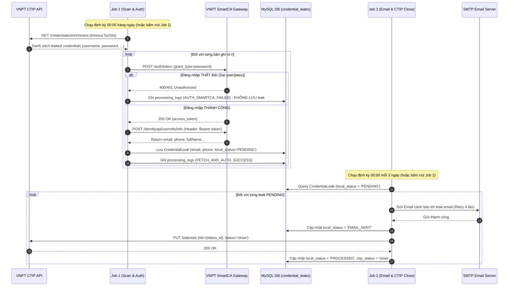

# KẾ HOẠCH THIẾT KẾ & CHUYỂN ĐỔI NGHIỆP VỤ HỆ THỐNG (PLAN2.MD)

## 1. TỔNG QUAN YÊU CẦU & MỤC TIÊU THAY ĐỔI

Hệ thống **VNPT Leak Processor** được tái cấu trúc nghiệp vụ từ mô hình đối soát khách hàng nội bộ (`Customer`) sang mô hình **xác thực trực tiếp & truy vấn thông tin người dùng qua cổng VNPT SmartCA (`gwsca.vnpt.vn`)**.

### Các thay đổi trọng tâm:
1. **Loại bỏ hoàn toàn bảng `Customer`**: Thông tin `email` và `phone` được lưu trực tiếp trên bảng `credential_leaks`.
2. **Quy trình xác thực & làm giàu dữ liệu SmartCA**:
   - Lấy danh sách rò rỉ từ CTIP API (có cơ chế timeout HTTP).
   - Thử đăng nhập qua SmartCA Auth API (`POST /auth/token` với `grant_type=password`).
   - **Chỉ khi đăng nhập thành công (tài khoản & mật khẩu đúng)** mới lưu bản ghi vào CSDL.
   - Tiếp tục gọi SmartCA Identity API (`POST /identityapi/userinfo/info` với Bearer access token) để lấy `email` và `phone` cập nhật vào CSDL.
3. **Phân tách Lập lịch (Scheduler) thành 2 Job độc lập**:
   - **Job 1 (1 ngày / 1 lần vào 00:00)**: Quét CTIP -> Xử lý Auth SmartCA -> Lấy Info -> Lưu CSDL (`PENDING`).
   - **Job 2 (3 ngày / 1 lần vào 00:00)**: Quét các bản ghi `PENDING` -> Gửi Email cảnh báo (có Retry) -> Đồng bộ đóng sự cố lên CTIP (`PROCESSED`).
4. **Cập nhật Giao diện Web (Dashboard)**:
   - Thay thế nút quét duy nhất thành **2 nút kích hoạt thủ công độc lập tương ứng với 2 Job**.
   - Bỏ màn hình quản lý Khách hàng (`Customer`), cập nhật bảng hiển thị Sự cố lộ lọt (`leaks.html`) với cột `Email` và `Phone`.

---

## 2. PHÂN TÍCH QUY TRÌNH LUỒNG DỮ LIỆU MỚI (WORKFLOW)



---

## 3. DANH SÁCH TASK CHI TIẾT THEO THỨ TỰ THỰC THI

### TASK 1: Cấu hình thuộc tính Timeout & SmartCA API trong `application.properties`
- [x] **File/Class/Module**: [application.properties](file:///c:/Users/Admin/Desktop/ThucTap/doc/leak-processor/src/main/resources/application.properties)
- [x] **Thành phần mới**: Thêm các thuộc tính cấu hình SmartCA API và Timeout cho HTTP Client:
  ```properties
  # Timeout configs
  ctip.api.connect-timeout-ms=5000
  ctip.api.read-timeout-ms=10000

  # SmartCA Gateway Configs
  smartca.api.url=https://gwsca.vnpt.vn
  smartca.api.client-id=4185-637127995547330633.apps.signserviceapi.com
  smartca.api.client-secret=NGNhMzdmOGE-OGM2Mi00MTg0
  smartca.api.connect-timeout-ms=5000
  smartca.api.read-timeout-ms=10000

  # Cron Schedules
  job1.scan.cron=0 0 0 * * *
  job2.email.cron=0 0 0 */3 * *
  ```
- [x] **Logic thay đổi**: Khai báo tham số cấu hình tĩnh giúp ứng dụng quản lý linh hoạt giữa môi trường Mock và Production.
- [x] **Input/Output**: Parameter keys -> Spring `@Value` injection.
- [x] **Dependency**: Độc lập (Task đầu tiên).
- [x] **Rủi ro/Ảnh hưởng**: Không gây rủi ro.

---

### TASK 2: Cập nhật Entity `CredentialLeak` & Xóa bỏ Entity/Module `Customer`
- [x] **File/Class/Module**: 
  - Modify: [CredentialLeak.java](file:///c:/Users/Admin/Desktop/ThucTap/doc/leak-processor/src/main/java/com/vnpt/leakprocessor/model/CredentialLeak.java), [CredentialLeakRepository.java](file:///c:/Users/Admin/Desktop/ThucTap/doc/leak-processor/src/main/java/com/vnpt/leakprocessor/repository/CredentialLeakRepository.java)
  - Delete: `Customer.java`, `CustomerRepository.java`, `CustomerController.java`, `CustomerMappingService.java`, `CustomerMappingServiceImpl.java`, `customers/list.html`, `customers/form.html`
- [x] **Thành phần mới**:
  - Thêm thuộc tính `email` (`@Column(name = "email", length = 100)`) vào `CredentialLeak`.
  - Thêm thuộc tính `phone` (`@Column(name = "phone", length = 20)`) vào `CredentialLeak`.
- [x] **Logic thay đổi**:
  - Xóa mối quan hệ `@ManyToOne Customer customer` và trường `customer_id`.
  - Loại bỏ toàn bộ code tham chiếu đến `Customer` trong repository và controller.
- [x] **Input/Output**: Entity schema DB MySQL tự động cập nhật via Hibernate (`ddl-auto=update`).
- [x] **Dependency**: Yêu cầu Task 1 hoàn tất.
- [x] **Rủi ro/Ảnh hưởng**: Cần cập nhật toàn bộ DTO/Service/UI có tham chiếu tới Customer.

---

### TASK 3: Tạo DTOs & Client tích hợp SmartCA Gateway (với RestTemplate Timeout)
- [x] **File/Class/Module**: 
  - New DTOs: `SmartCaTokenResponse.java`, `SmartCaUserInfoResponse.java`
  - New Client: `SmartCaClient.java`, `SmartCaClientImpl.java` (trong package `client` và `client.impl`)
- [x] **Thành phần mới**:
  - `SmartCaTokenResponse`: Lưu `access_token`, `token_type`, `expires_in`, `error`, `error_description`.
  - `SmartCaUserInfoResponse`: Map cấu trúc JSON trả về với 2 trường duy nhất trong `content` là `email` và `phone` (sử dụng `@JsonIgnoreProperties(ignoreUnknown = true)` để bỏ qua các trường không cần thiết khác).
  - `SmartCaClientImpl`: Sử dụng `RestTemplateBuilder` cài đặt `setConnectTimeout(Duration.ofMillis(5000))` và `setReadTimeout(Duration.ofMillis(10000))`.
- [x] **Logic thay đổi**:
  - Method `String loginAndGetToken(String username, String password)`: Gửi HTTP POST `application/x-www-form-urlencoded` tới `/auth/token`.
  - Method `SmartCaUserInfoResponse getUserInfo(String accessToken)`: Gửi HTTP POST tới `/identityapi/userinfo/info` kèm Header `Authorization: Bearer <accessToken>`.
- [x] **Input/Output**: Username/Password -> Access Token -> Email & Phone.
- [x] **Dependency**: Yêu cầu Task 1 & 2 hoàn tất.
- [x] **Rủi ro/Ảnh hưởng**: Cần bắt ngoại lệ `HttpClientErrorException` (400 Bad Request / 401 Unauthorized) khi đăng nhập sai password để trả về null thay vì văng Exception làm sập tiến trình.

---

### TASK 4: Tạo Controller Mock cho SmartCA Gateway (Phục vụ Test Local & Offline)
- [x] **File/Class/Module**: [SmartCaMockController.java](file:///c:/Users/Admin/Desktop/ThucTap/doc/leak-processor/src/main/java/com/vnpt/leakprocessor/controller/SmartCaMockController.java) (trong package `controller`)
- [x] **Thành phần mới**: RestController giả lập 2 endpoint của SmartCA:
  - `@PostMapping("/auth/token")`: Kiểm tra nếu `username` và `password` khớp với tài khoản giả lập thì trả về `access_token` ngẫu nhiên. Ngược lại trả về 400 Bad Request.
  - `@PostMapping("/identityapi/userinfo/info")`: Kiểm tra Bearer token và trả về thông tin `email` và `phone` mẫu.
- [x] **Logic thay đổi**: Cho phép hệ thống test full luồng không cần internet hoặc khi môi trường SmartCA thật chưa sẵn sàng.
- [x] **Input/Output**: Credential form-data -> Mock JSON Token / UserInfo.
- [x] **Dependency**: Yêu cầu Task 3 hoàn tất.
- [x] **Rủi ro/Ảnh hưởng**: Không ảnh hưởng code chính.

---

### TASK 5: Nâng cấp `CtipClientImpl` với cấu hình Timeout cho HTTP Call CTIP
- [x] **File/Class/Module**: [CtipClientImpl.java](file:///c:/Users/Admin/Desktop/ThucTap/doc/leak-processor/src/main/java/com/vnpt/leakprocessor/client/impl/CtipClientImpl.java)
- [x] **Logic thay đổi**:
  - Thay thế việc khởi tạo `new RestTemplate()` mặc định bằng `SimpleClientHttpRequestFactory` có thiết lập connect timeout (5s) và read timeout (10s) đọc từ `@Value("${ctip.api.connect-timeout-ms}")` và `@Value("${ctip.api.read-timeout-ms}")`.
- [x] **Input/Output**: HTTP Call có cơ chế tự động ngắt khi quá thời gian phản hồi (timeout).
- [x] **Dependency**: Yêu cầu Task 1 hoàn tất.
- [x] **Rủi ro/Ảnh hưởng**: Đảm bảo không bị treo thread khi gọi CTIP API bị nghẽn mạng.

---

### TASK 6: Tái cấu trúc Tầng Service thành 2 Service chuyên biệt (`LeakFetchService` & `LeakNotificationService`)
- [x] **File/Class/Module**: 
  - New: [LeakFetchService.java](file:///c:/Users/Admin/Desktop/ThucTap/doc/leak-processor/src/main/java/com/vnpt/leakprocessor/service/LeakFetchService.java), [LeakFetchServiceImpl.java](file:///c:/Users/Admin/Desktop/ThucTap/doc/leak-processor/src/main/java/com/vnpt/leakprocessor/service/impl/LeakFetchServiceImpl.java) (Job 1: Fetch CTIP & Verify SmartCA)
  - New: [LeakNotificationService.java](file:///c:/Users/Admin/Desktop/ThucTap/doc/leak-processor/src/main/java/com/vnpt/leakprocessor/service/LeakNotificationService.java), [LeakNotificationServiceImpl.java](file:///c:/Users/Admin/Desktop/ThucTap/doc/leak-processor/src/main/java/com/vnpt/leakprocessor/service/impl/LeakNotificationServiceImpl.java) (Job 2: Send Email & CTIP Sync)
  - Modify: [LeakProcessorService.java](file:///c:/Users/Admin/Desktop/ThucTap/doc/leak-processor/src/main/java/com/vnpt/leakprocessor/service/LeakProcessorService.java), [LeakProcessorServiceImpl.java](file:///c:/Users/Admin/Desktop/ThucTap/doc/leak-processor/src/main/java/com/vnpt/leakprocessor/service/impl/LeakProcessorServiceImpl.java) (Orchestrator Facade)
- [x] **Logic thay đổi**:
  - Tách xử lý thành 2 Service chuyên biệt tuân thủ Nguyên lý Đơn trách nhiệm (Single Responsibility Principle):
    1. **`LeakFetchService` (Job 1)**:
       - Phương thức: `processJob1FetchAndVerify()`, `processJob1Async(JobHistory job)`
       - Quét danh sách rò rỉ từ CTIP API.
       - Với từng leak, kiểm tra nếu `credentialId` chưa tồn tại trong DB thì gọi `smartCaClient.loginAndGetToken(username, password)`.
       - **Nếu thất bại (Null Token)**: Không lưu `credential_leaks`, lưu `ProcessingLog` (step = `AUTH_SMARTCA`, status = `FAILED`, message = "Đăng nhập SmartCA thất bại").
       - **Nếu thành công**: Gọi `smartCaClient.getUserInfo(token)`, lấy `email` & `phone`. Lưu `CredentialLeak` mới với `local_status = 'PENDING'`, `email`, `phone`.
    2. **`LeakNotificationService` (Job 2)**:
       - Phương thức: `processJob2SendEmailsAndSyncCtip()`, `processJob2Async(JobHistory job)`
       - Quét các `CredentialLeak` có `local_status = 'PENDING'`.
       - Gửi email cảnh báo tới `leak.getEmail()` (sử dụng `@Retryable`).
       - Cập nhật `local_status = 'EMAIL_SENT'`.
       - Đồng bộ đóng sự cố lên CTIP qua `ctipClient.updateCtipStatus()`.
       - Cập nhật `local_status = 'PROCESSED'`, `ctipStatus = 'close'`.
    3. **`LeakProcessorService` (Orchestrator Facade)**:
       - Giữ vai trò điều phối tổng thể, gọi tới `LeakFetchService` và `LeakNotificationService`.
- [x] **Input/Output**: Job 1 tạo leaks `PENDING`; Job 2 xử lý leaks `PENDING` -> `PROCESSED`.
- [x] **Dependency**: Yêu cầu Task 2, 3, 5 hoàn tất.
- [x] **Rủi ro/Ảnh hưởng**: Cấu trúc rõ ràng, chuẩn hóa Spring Service layering. Cần đảm bảo các annotation `@Transactional` và `@Async` hoạt động chính xác qua Spring proxy.

---

### TASK 7: Cập nhật `LeakProcessorScheduler` chia làm 2 Job Lập lịch riêng biệt
- [x] **File/Class/Module**: [LeakProcessorScheduler.java](file:///c:/Users/Admin/Desktop/ThucTap/doc/leak-processor/src/main/java/com/vnpt/leakprocessor/scheduler/LeakProcessorScheduler.java)
- [x] **Logic thay đổi**:
  - Tạo 2 phương thức `@Scheduled`:
    1. `runJob1ScanAndVerify()` với `@Scheduled(cron = "${job1.scan.cron:0 0 0 * * *}")` (12h đêm hàng ngày).
    2. `runJob2SendEmailAndSync()` với `@Scheduled(cron = "${job2.email.cron:0 0 0 */3 * *}")` (12h đêm mỗi 3 ngày).
- [x] **Input/Output**: Cron Trigger -> Kích hoạt Job 1 hoặc Job 2 tương ứng.
- [x] **Dependency**: Yêu cầu Task 6 hoàn tất.
- [x] **Rủi ro/Ảnh hưởng**: Đảm bảo 2 job chạy độc lập, không chồng chéo.

---

### TASK 8: Cập nhật REST Controller & Web UI (2 Nút kích hoạt + Bảng hiển thị Leaks)
- [x] **File/Class/Module**: 
  - [JobRestController.java](file:///c:/Users/Admin/Desktop/ThucTap/doc/leak-processor/src/main/java/com/vnpt/leakprocessor/controller/JobRestController.java)
  - [DashboardController.java](file:///c:/Users/Admin/Desktop/ThucTap/doc/leak-processor/src/main/java/com/vnpt/leakprocessor/controller/DashboardController.java)
  - [dashboard.html](file:///c:/Users/Admin/Desktop/ThucTap/doc/leak-processor/src/main/resources/templates/dashboard.html)
  - [leaks.html](file:///c:/Users/Admin/Desktop/ThucTap/doc/leak-processor/src/main/resources/templates/dashboard/leaks.html)
  - [layout.html](file:///c:/Users/Admin/Desktop/ThucTap/doc/leak-processor/src/main/resources/templates/layout.html)
- [x] **Logic thay đổi**:
  - Trong `JobRestController.java`: Tạo 2 API endpoint:
    - `POST /api/v1/jobs/trigger-job1`: Kích hoạt Job 1 chạy bất đồng bộ.
    - `POST /api/v1/jobs/trigger-job2`: Kích hoạt Job 2 chạy bất đồng bộ.
  - Trong `dashboard.html`:
    - Xóa nút "Quét thủ công" đơn lẻ cũ.
    - Thêm 2 nút bấm: **"Chạy Job 1: Quét CTIP & Xác thực SmartCA"** và **"Chạy Job 2: Gửi Email & Đóng CTIP"**.
    - Cập nhật JS AJAX Polling để hiển thị tiến độ thời gian thực cho từng Job tương ứng.
  - Trong `leaks.html`: Xóa cột Khách hàng (`Customer`), thay bằng 2 cột **Email** (`leak.email`) và **Số điện thoại** (`leak.phone`).
  - Trong `layout.html`: Xóa mục Menu "Quản lý khách hàng".
- [x] **Input/Output**: Click Nút UI -> REST API -> AJAX status updates.
- [x] **Dependency**: Yêu cầu Task 6, 7 hoàn tất.
- [x] **Rủi ro/Ảnh hưởng**: Cập nhật JS polling chính xác theo response JSON mới của JobRestController.

---

### TASK 9: Cập nhật `DataInitializer` & Bộ Test Tích hợp JUnit
- [x] **File/Class/Module**: 
  - [DataInitializer.java](file:///c:/Users/Admin/Desktop/ThucTap/doc/leak-processor/src/main/java/com/vnpt/leakprocessor/config/DataInitializer.java)
  - [EndToEndPipelineTests.java](file:///c:/Users/Admin/Desktop/ThucTap/doc/leak-processor/src/test/java/com/vnpt/leakprocessor/EndToEndPipelineTests.java)
  - [RetryAndCtipSyncTests.java](file:///c:/Users/Admin/Desktop/ThucTap/doc/leak-processor/src/test/java/com/vnpt/leakprocessor/RetryAndCtipSyncTests.java)
  - [Job1AndJob2SeparateServicesTests.java](file:///c:/Users/Admin/Desktop/ThucTap/doc/leak-processor/src/test/java/com/vnpt/leakprocessor/Job1AndJob2SeparateServicesTests.java)
- [x] **Logic thay đổi**:
  - Trong `DataInitializer`: Xóa bỏ hàm `initDefaultCustomers()`. Giữ nguyên hàm khởi tạo Email Template `smartca-warning`.
  - Trong các file Test: Sửa đổi các câu lệnh assertion và mock data để loại bỏ `Customer`, cập nhật test case kiểm thử luồng đăng nhập SmartCA và lấy Email/Phone.
- [x] **Input/Output**: `mvn test` báo `BUILD SUCCESS` (100% tests pass).
- [x] **Dependency**: Yêu cầu Task 1 -> 8 hoàn tất.
- [x] **Rủi ro/Ảnh hưởng**: Đảm bảo toàn bộ unit/integration tests vượt qua thành công.

---

## 4. BẢNG TỔNG HỢP KIỂM TRA MÔ HÌNH CÁC LAYER (LAYER COVERAGE CHECK)

| Layer | Các thành phần thay đổi / thêm mới | Trạng thái kiểm tra |
|-------|------------------------------------|---------------------|
| **Configuration** | `application.properties` (Timeout, SmartCA configs, Cron) | ✅ Đã bao gồm (Task 1) |
| **Model / Entity** | `CredentialLeak` (Thêm email, phone; xóa Customer reference) | ✅ Đã bao gồm (Task 2) |
| **Repository** | `CredentialLeakRepository` (Xóa CustomerRepository) | ✅ Đã bao gồm (Task 2) |
| **DTO** | `SmartCaTokenResponse`, `SmartCaUserInfoResponse` | ✅ Đã bao gồm (Task 3) |
| **Client / Integration** | `SmartCaClientImpl` (Timeout, Auth, Info), `MockCtipClientImpl` | ✅ Đã bao gồm (Task 3, 5) |
| **Mock Controller** | `SmartCaMockController` | ✅ Đã bao gồm (Task 4) |
| **Service Layer** | `LeakProcessorServiceImpl` (Job 1 & Job 2 separate workflows) | ✅ Đã bao gồm (Task 6) |
| **Scheduler Layer** | `LeakProcessorScheduler` (2 Cron: 1 ngày & 3 ngày) | ✅ Đã bao gồm (Task 7) |
| **REST Controller** | `JobRestController` (trigger-job1, trigger-job2) | ✅ Đã bao gồm (Task 8) |
| **View / UI Layer** | `dashboard.html` (2 nút bấm), `leaks.html` (Email/Phone columns) | ✅ Đã bao gồm (Task 8) |
| **Data Init & Test** | `DataInitializer`, `EndToEndPipelineTests`, `RetryAndCtipSyncTests` | ✅ Đã bao gồm (Task 9) |

---
*Tài liệu Kế hoạch PLAN2.md được tạo tự động để chuẩn hóa luồng phát triển và kiểm thử hệ thống VNPT Leak Processor.*
