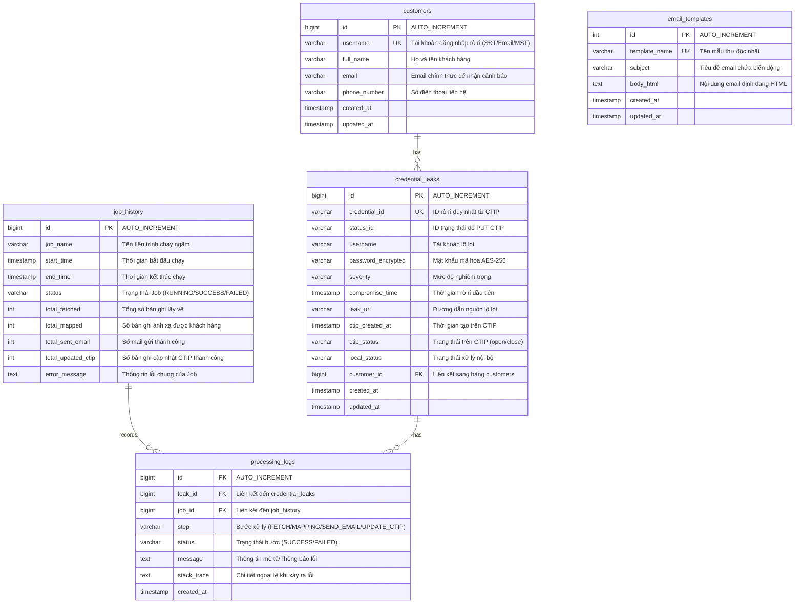

# TÀI LIỆU THIẾT KẾ CƠ SỞ DỮ LIỆU (DATABASE DESIGN)
## Hệ thống Cảnh báo và Cập nhật Trạng thái Tài khoản Lộ lọt từ VNPT CTIP

---

## 1. Sơ đồ Quan hệ Thực thể (Entity-Relationship Diagram)

Sơ đồ ER dưới đây thể hiện mối quan hệ giữa các bảng trong cơ sở dữ liệu MySQL của hệ thống.

---

## 2. Chi tiết các Bảng và Thuộc tính (Detailed Schema)

### 2.1. Bảng `customers` (Thông tin Khách hàng)
Lưu trữ thông tin khách hàng hiện tại của đơn vị (CA, SmartCA, Ký số...). Bảng này đóng vai trò quan trọng để hệ thống đối chiếu từ `username` lộ lọt sang thông tin `email` nhận cảnh báo.

| Tên Thuộc tính | Kiểu Dữ liệu | Ràng buộc | Mô tả |
| :--- | :--- | :--- | :--- |
| `id` | BIGINT | PRIMARY KEY, AUTO_INCREMENT | Khóa chính tự sinh của hệ thống. |
| `username` | VARCHAR(100) | UNIQUE, NOT NULL | Tên tài khoản dịch vụ của khách hàng (Có thể là Số điện thoại, Email hoặc Mã số thuế). |
| `full_name` | VARCHAR(255) | NULL | Họ và tên khách hàng/Tên doanh nghiệp. |
| `email` | VARCHAR(255) | NOT NULL | Địa chỉ email chính thức của khách hàng dùng để gửi thư cảnh báo. |
| `phone_number`| VARCHAR(20) | NULL | Số điện thoại liên hệ của khách hàng. |
| `created_at` | TIMESTAMP | DEFAULT CURRENT_TIMESTAMP | Thời điểm tạo bản ghi thông tin khách hàng. |
| `updated_at` | TIMESTAMP | DEFAULT CURRENT_TIMESTAMP ON UPDATE CURRENT_TIMESTAMP | Thời điểm cập nhật thông tin khách hàng gần nhất. |

- **Chỉ mục (Index)**:
  - `idx_customers_username`: INDEX trên cột `username` (Tăng tốc độ tìm kiếm khi ánh xạ tài khoản lộ lọt).
  - `idx_customers_email`: INDEX trên cột `email`.

---

### 2.2. Bảng `credential_leaks` (Chi tiết Tài khoản Lộ lọt)
Bảng lưu trữ thông tin rò rỉ thu thập được từ VNPT CTIP qua mỗi chu kỳ quét để theo dõi trạng thái xử lý cục bộ và tránh gửi mail lặp lại.

| Tên Thuộc tính | Kiểu Dữ liệu | Ràng buộc | Mô tả |
| :--- | :--- | :--- | :--- |
| `id` | BIGINT | PRIMARY KEY, AUTO_INCREMENT | Khóa chính tự sinh. |
| `credential_id`| VARCHAR(100)| UNIQUE, NOT NULL | Mã ID rò rỉ duy nhất nhận từ thuộc tính `credential_id` của CTIP. |
| `status_id` | VARCHAR(100) | NOT NULL | ID trạng thái lộ lọt trên CTIP (`status_id`), dùng làm khóa truyền vào API PUT cập nhật trạng thái. |
| `username` | VARCHAR(100) | NOT NULL | Tên đăng nhập bị rò rỉ (lấy trực tiếp từ CTIP). |
| `password_encrypted` | VARCHAR(512) | NOT NULL | Mật khẩu rò rỉ lấy về từ CTIP đã được mã hóa AES-256 trước khi lưu. |
| `severity` | VARCHAR(20) | NOT NULL | Mức độ nghiêm trọng từ CTIP (`low`, `medium`, `high`, `critical`). |
| `compromise_time`| TIMESTAMP | NULL | Thời gian lộ lọt đầu tiên (`first_compromise_time` từ CTIP). |
| `leak_url` | VARCHAR(2048)| NULL | Đường dẫn (URL) nơi thông tin bị lộ lọt. |
| `ctip_created_at`| TIMESTAMP | NOT NULL | Thời gian rò rỉ được ghi nhận trên hệ thống CTIP (`created_at` từ CTIP). |
| `ctip_status` | VARCHAR(20) | NOT NULL | Trạng thái hiện tại trên CTIP (`open` hoặc `close`). |
| `local_status` | VARCHAR(30) | NOT NULL | Trạng thái xử lý nội bộ (`PENDING`, `EMAIL_SENT`, `PROCESSED`, `CUSTOMER_NOT_FOUND`, `EMAIL_FAILED`, `CTIP_UPDATE_FAILED`). |
| `customer_id` | BIGINT | FOREIGN KEY | Liên kết đến `id` của bảng `customers` (nếu tìm thấy khách hàng ứng với username). |
| `created_at` | TIMESTAMP | DEFAULT CURRENT_TIMESTAMP | Thời điểm hệ thống nội bộ lưu bản ghi. |
| `updated_at` | TIMESTAMP | DEFAULT CURRENT_TIMESTAMP ON UPDATE CURRENT_TIMESTAMP | Thời điểm cập nhật trạng thái bản ghi nội bộ gần nhất. |

- **Chỉ mục (Index)**:
  - `idx_leaks_credential_id`: UNIQUE INDEX trên `credential_id` để ngăn ngừa lưu trùng bản ghi lộ lọt.
  - `idx_leaks_status_id`: INDEX trên `status_id` phục vụ tra cứu nhanh khi gọi API PUT.
  - `idx_leaks_local_status`: INDEX trên `local_status` để nhanh chóng lọc các bản ghi cần xử lý lại hoặc gửi mail.
  - `fk_leaks_customer`: Khóa ngoại liên kết cột `customer_id` đến `customers(id)`.

---

### 2.3. Bảng `email_templates` (Mẫu Thư Cảnh báo)
Quản lý các mẫu thư cảnh báo gửi tới khách hàng, giúp dễ dàng thay đổi nội dung thư mà không cần sửa code và build lại ứng dụng.

| Tên Thuộc tính | Kiểu Dữ liệu | Ràng buộc | Mô tả |
| :--- | :--- | :--- | :--- |
| `id` | INT | PRIMARY KEY, AUTO_INCREMENT | Khóa chính tự sinh. |
| `template_name`| VARCHAR(100)| UNIQUE, NOT NULL | Tên mẫu thư (ví dụ: `leak_warning_vi`, `leak_warning_en`). |
| `subject` | VARCHAR(255) | NOT NULL | Tiêu đề email (hỗ trợ biến động như `[Cảnh báo] Rò rỉ thông tin mật khẩu dịch vụ CA cho tài khoản ${username}`). |
| `body_html` | TEXT | NOT NULL | Nội dung thư dạng HTML định dạng CSS inline, chứa các tham số động `${customer_name}`, `${password_masked}`, v.v. |
| `created_at` | TIMESTAMP | DEFAULT CURRENT_TIMESTAMP | Thời điểm tạo mẫu thư. |
| `updated_at` | TIMESTAMP | DEFAULT CURRENT_TIMESTAMP ON UPDATE CURRENT_TIMESTAMP | Thời điểm cập nhật mẫu thư gần nhất. |

---

### 2.4. Bảng `job_history` (Lịch sử Thực thi Tác vụ Ngầm)
Ghi nhận thông tin tổng quát của mỗi chu kỳ chạy tác vụ lập lịch hàng ngày (Job Run), phục vụ việc giám sát hoạt động tổng thể của hệ thống.

| Tên Thuộc tính | Kiểu Dữ liệu | Ràng buộc | Mô tả |
| :--- | :--- | :--- | :--- |
| `id` | BIGINT | PRIMARY KEY, AUTO_INCREMENT | Khóa chính tự sinh. |
| `job_name` | VARCHAR(100) | NOT NULL | Tên của Task/Job (ví dụ: `DailyCredentialLeakScanJob`). |
| `start_time` | TIMESTAMP | NOT NULL | Thời điểm bắt đầu chạy Job. |
| `end_time` | TIMESTAMP | NULL | Thời điểm kết thúc Job (bằng NULL nếu đang chạy). |
| `status` | VARCHAR(20) | NOT NULL | Trạng thái Job: `RUNNING` (đang chạy), `SUCCESS` (hoàn thành không lỗi), `FAILED` (gặp lỗi nghiêm trọng dừng Job). |
| `total_fetched` | INT | DEFAULT 0 | Tổng số bản ghi lộ lọt quét được từ CTIP trong lượt chạy này. |
| `total_mapped` | INT | DEFAULT 0 | Số lượng tài khoản lộ lọt ánh xạ thành công sang Email khách hàng. |
| `total_sent_email`| INT | DEFAULT 0 | Tổng số email cảnh báo đã gửi thành công trong Job này. |
| `total_updated_ctip`| INT | DEFAULT 0 | Tổng số bản ghi được cập nhật trạng thái "close" thành công lên CTIP. |
| `error_message` | TEXT | NULL | Ghi thông tin lỗi exception dạng chuỗi nếu Job bị thất bại hoàn toàn. |

---

### 2.5. Bảng `processing_logs` (Nhật ký Xử lý Chi tiết)
Lưu nhật ký từng bước cho từng bản ghi lộ lọt riêng biệt trong quá trình xử lý để phục vụ tra cứu lỗi chi tiết (Audit Trail) khi khách hàng thắc mắc hoặc có lỗi API.

| Tên Thuộc tính | Kiểu Dữ liệu | Ràng buộc | Mô tả |
| :--- | :--- | :--- | :--- |
| `id` | BIGINT | PRIMARY KEY, AUTO_INCREMENT | Khóa chính tự sinh. |
| `leak_id` | BIGINT | FOREIGN KEY, NULL | Liên kết tới `credential_leaks(id)` để biết bước này thuộc bản ghi lộ lọt nào. (Null nếu lỗi xảy ra khi gọi API GET lấy trang trước khi tạo bản ghi leak). |
| `job_id` | BIGINT | FOREIGN KEY, NOT NULL | Liên kết tới `job_history(id)` xác định log này thuộc lượt chạy Job nào. |
| `step` | VARCHAR(50) | NOT NULL | Bước xử lý xảy ra log: `FETCH`, `MAPPING`, `SEND_EMAIL`, `UPDATE_CTIP`. |
| `status` | VARCHAR(20) | NOT NULL | Trạng thái của bước: `SUCCESS` hoặc `FAILED`. |
| `message` | TEXT | NULL | Thông tin mô tả kết quả xử lý hoặc thông báo lỗi ngắn gọn. |
| `stack_trace` | TEXT | NULL | Ghi nhận chi tiết Stacktrace của Exception nếu bước này bị `FAILED` (phục vụ lập trình viên debug). |
| `created_at` | TIMESTAMP | DEFAULT CURRENT_TIMESTAMP | Thời điểm ghi nhận log. |

- **Chỉ mục (Index)**:
  - `idx_logs_job_id`: INDEX trên cột `job_id` phục vụ truy vấn log theo Job.
  - `idx_logs_leak_id`: INDEX trên cột `leak_id` phục vụ truy vấn lịch sử xử lý của riêng một tài khoản lộ lọt.

---

## 3. Giải thích Quan hệ giữa các Bảng (Relationship Explanations)

1. **Quan hệ giữa `customers` và `credential_leaks` (Một - Nhiều: 1-N)**:
   - Một khách hàng (`customers`) có thể bị lộ lọt thông tin nhiều lần tại các thời điểm khác nhau hoặc trên các nguồn web khác nhau, dẫn tới có nhiều bản ghi trong bảng `credential_leaks` tham chiếu về.
   - Ngược lại, một bản ghi `credential_leaks` khi ánh xạ thành công sẽ liên kết với duy nhất một khách hàng (`customer_id`). Nếu thông tin tài khoản lộ lọt của CTIP không khớp với bất kỳ khách hàng nào trong hệ thống, trường `customer_id` sẽ nhận giá trị `NULL`.

2. **Quan hệ giữa `job_history` và `processing_logs` (Một - Nhiều: 1-N)**:
   - Mỗi lần chạy Scheduler Job (`job_history`) sẽ sinh ra nhiều bước xử lý cho hàng trăm tài khoản lộ lọt khác nhau. Do đó, một lịch sử Job sẽ liên kết với nhiều dòng ghi nhật ký xử lý (`processing_logs`) thông qua khóa ngoại `job_id`.

3. **Quan hệ giữa `credential_leaks` và `processing_logs` (Một - Nhiều: 1-N)**:
   - Một bản ghi tài khoản lộ lọt (`credential_leaks`) trải qua nhiều trạng thái và hành động xử lý kế tiếp nhau (ánh xạ khách hàng -> gửi email -> cập nhật trạng thái CTIP). Mỗi bước xử lý này đều ghi lại kết quả thành công/thất bại tương ứng vào `processing_logs` để dễ theo dõi tiến trình của bản ghi đó thông qua khóa ngoại `leak_id`.

---

## 4. Ràng buộc Toàn vẹn và Tối ưu hóa (Integrity Constraints & Index Optimization)

1. **Khóa ngoại (Foreign Key Constraints)**:
   - Cấu hình `ON DELETE SET NULL` cho quan hệ `customers` -> `credential_leaks` nhằm đảm bảo nếu thông tin khách hàng bị xóa khỏi hệ thống, dữ liệu phục vụ đối soát lộ lọt lịch sử vẫn được giữ lại với cột `customer_id` chuyển về `NULL`.
   - Cấu hình `ON DELETE CASCADE` cho quan hệ từ `credential_leaks` -> `processing_logs` và `job_history` -> `processing_logs`. Nếu xóa bản ghi rò rỉ hoặc lịch sử Job (dọn dẹp dữ liệu cũ), các log con tương ứng sẽ tự động bị xóa để tiết kiệm dung lượng bộ nhớ.

2. **Tối ưu hóa Index**:
   - Sử dụng kiểu dữ liệu `VARCHAR` với độ dài vừa đủ để lưu trữ mã định danh dạng UUID (`credential_id`, `status_id`). Việc này giúp thu hẹp kích thước Index và đẩy nhanh tốc độ so sánh chuỗi trong MySQL.
   - Định kỳ phân tích cơ sở dữ liệu và dọn dẹp phân mảnh chỉ mục để đảm bảo tốc độ ghi log nhanh mà không gây tắc nghẽn khóa bảng (Table Lock).
