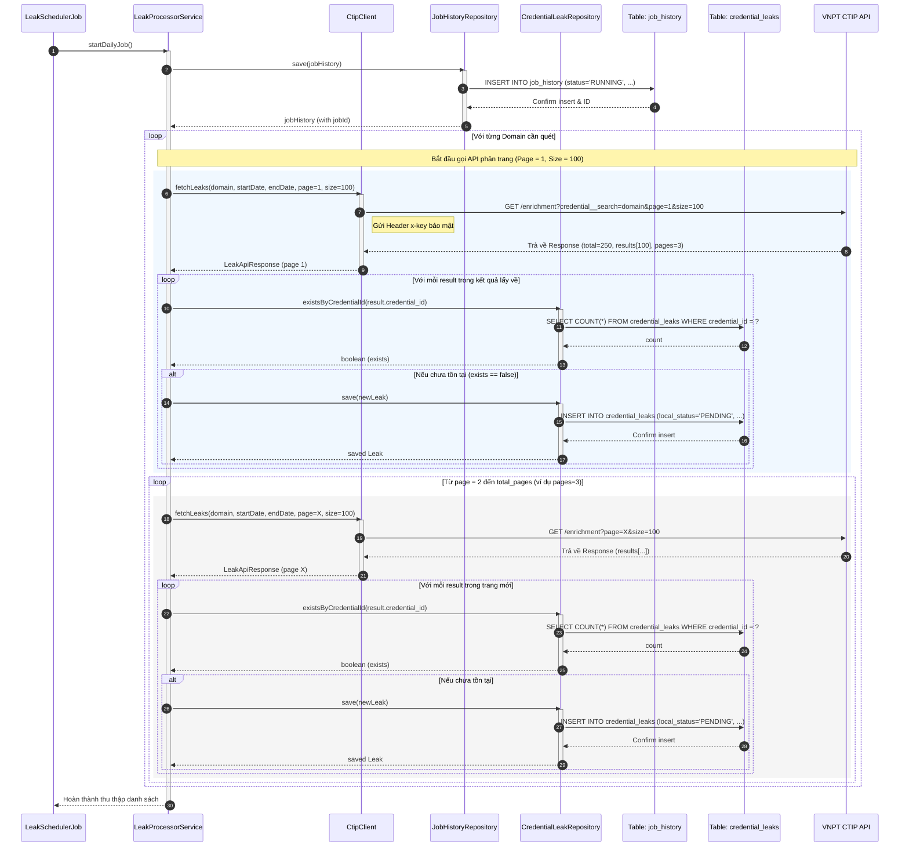
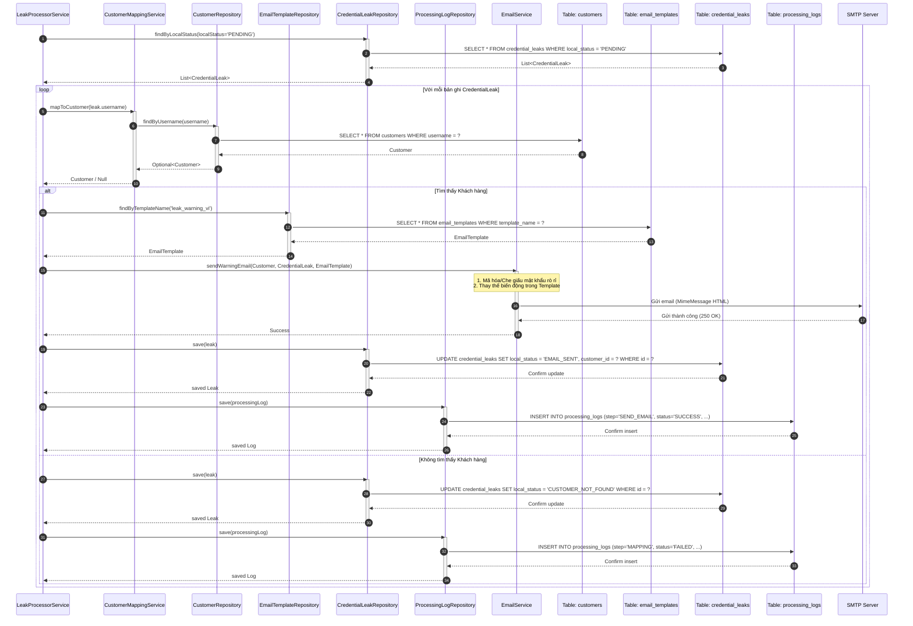
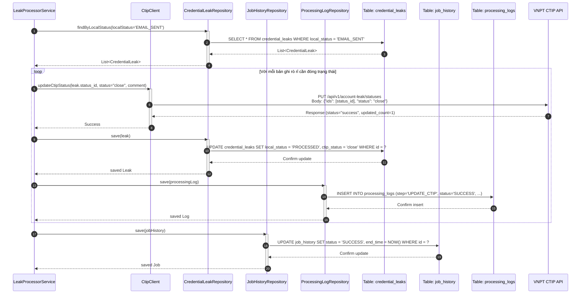
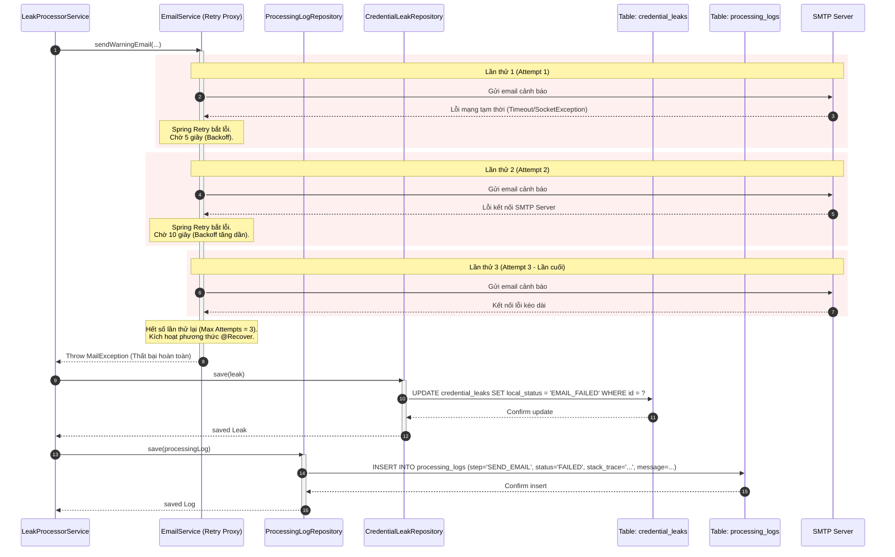
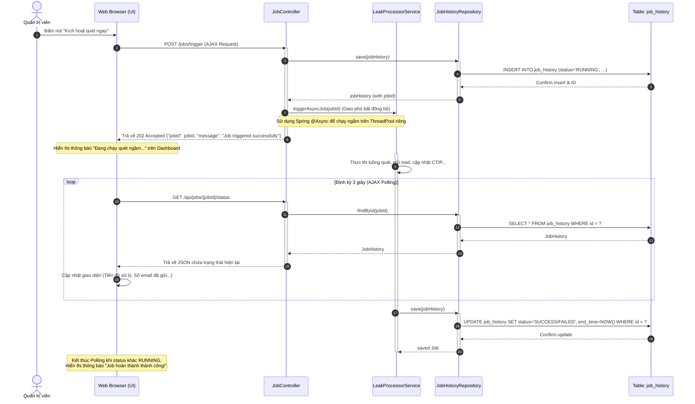

# TÀI LIỆU THIẾT KẾ CHI TIẾT (LOW LEVEL DESIGN - LLD)
## Hệ thống Cảnh báo và Cập nhật Trạng thái Tài khoản Lộ lọt từ VNPT CTIP

---

## 1. Thiết kế Lớp (Class Design / Component Detail)

Hệ thống được phát triển dựa trên Spring Boot. Dưới đây là các lớp và interface chính cấu thành nên logic nghiệp vụ của ứng dụng:

### 1.1. Các Lớp Mô hình Dữ liệu (Entity Model Classes)
- **`Customer`**: Map với bảng `customers`. Chứa thông tin tài khoản đăng nhập và địa chỉ email của khách hàng.
- **`CredentialLeak`**: Map với bảng `credential_leaks`. Lưu trữ chi tiết thông tin tài khoản lộ lọt và trạng thái xử lý cục bộ.
- **`EmailTemplate`**: Map với bảng `email_templates`. Lưu trữ mẫu thư HTML.
- **`JobHistory`**: Map với bảng `job_history`. Quản lý trạng thái và thống kê số liệu của mỗi lượt chạy Job.
- **`ProcessingLog`**: Map với bảng `processing_logs`. Lưu nhật ký chi tiết của từng bước xử lý.

### 1.2. Các Lớp Truy cập Cơ sở Dữ liệu (Spring Data JPA Repositories)
- **`CustomerRepository`**: Khai báo các truy vấn tìm kiếm khách hàng, đặc biệt là `Optional<Customer> findByUsername(String username)`.
- **`CredentialLeakRepository`**: Quản lý việc lưu, cập nhật và truy vấn danh sách lộ lọt. `boolean existsByCredentialId(String credentialId)`.
- **`EmailTemplateRepository`**: Truy vấn mẫu email theo tên.
- **`JobHistoryRepository`** & **`ProcessingLogRepository`**: Ghi log vào cơ sở dữ liệu.

### 1.3. Các Lớp Nghiệp vụ Chính (Services)
- **`LeakSchedulerJob`**:
  - Chức năng: Chứa phương thức `@Scheduled` để kích hoạt chu kỳ quét tự động.
  - Gọi đến `LeakProcessorService` để bắt đầu quy trình.
- **`LeakProcessorService`**:
  - Chức năng: Điều phối toàn bộ luồng xử lý (Fetch -> Map Customer -> Send Email -> Update CTIP -> Log).
- **`CtipClient`**:
  - Chức năng: Giao tiếp REST API với VNPT CTIP.
  - Sử dụng `@Retryable` của Spring Retry cho hai hàm `fetchLeaks(...)` và `updateStatus(...)`.
- **`CustomerMappingService`**:
  - Chức năng: Thực hiện nghiệp vụ tìm kiếm khách hàng tương ứng với username bị lộ lọt.
- **`EmailService`**:
  - Chức năng: Sinh email từ template Thymeleaf/FreeMarker và gửi qua `JavaMailSender`.
  - Sử dụng `@Retryable` cho hàm `sendEmail(...)`.
- **`DatabaseLoggerService`**:
  - Chức năng: Ghi nhận nhật ký xử lý, lưu stacktrace lỗi khi gặp Exception.

### 1.4. Các Lớp Điều khiển Giao diện (Web Controllers)
- **`DashboardController`**:
  - Chức năng: Xử lý request trang chủ (`/` hoặc `/dashboard`). Tính toán các số liệu tổng hợp (thành công, thất bại, pending) từ Database gửi ra giao diện Thymeleaf template.
- **`JobController`**:
  - Chức năng: Tiếp nhận request kích hoạt quét thủ công (`POST /jobs/trigger`). Gọi bất đồng bộ `LeakProcessorService` để khởi chạy tiến trình quét ngay lập tức.
- **`CustomerController`**:
  - Chức năng: Cung cấp giao diện CRUD khách hàng (`/customers`), hiển thị bảng danh sách, nhận dữ liệu lưu/sửa/xóa khách hàng.
- **`EmailTemplateController`**:
  - Chức năng: Cho phép xem và chỉnh sửa mẫu email (`/templates`).
- **`LogController`**:
  - Chức năng: Hiển thị bảng nhật ký xử lý chi tiết (`/logs`), hỗ trợ lọc tìm kiếm và phân trang dữ liệu log.

---

## 2. Sơ đồ Tuần tự theo từng Chức năng (Sequence Diagrams)

### 2.1. Chức năng 1: Lập lịch và Thu thập Dữ liệu Lộ lọt từ CTIP (Fetch & Pagination)
Mô tả tiến trình Scheduler kích hoạt Job, gọi API CTIP để lấy dữ liệu. Đặc biệt xử lý việc phân trang tự động khi số lượng bản ghi vượt quá 100 dòng.



#### Giải thích luồng tương tác (Flow Explanation):
1. **Lập lịch tự động**: Lớp `LeakSchedulerJob` được kích hoạt định kỳ theo thời gian cron đã cấu hình, gọi phương thức `startDailyJob()` trong `LeakProcessorService`.
2. **Khởi tạo lịch sử Job**: `LeakProcessorService` gọi đến `JobHistoryRepository` lưu trữ một thực thể `JobHistory` mới. Repository thực hiện câu lệnh SQL `INSERT` trực tiếp xuống bảng `job_history` ở trạng thái `RUNNING` và trả về đối tượng có chứa `jobId`.
3. **Lấy danh sách Domain**: Hệ thống đọc cấu hình các domain cần quét từ file cấu hình/database.
4. **Yêu cầu HTTP GET (Trang 1)**: Với mỗi tên miền, `LeakProcessorService` yêu cầu `CtipClient` gọi API của VNPT CTIP qua cổng HTTP GET với API Key trong Header `x-key` và các tham số phân trang (`page=1`, `size=100`).
5. **Kiểm tra trùng và Lưu dữ liệu**: 
   - Với mỗi bản ghi rò rỉ lấy về, `LeakProcessorService` gọi `CredentialLeakRepository.existsByCredentialId(...)` để truy vấn trực tiếp bảng `credential_leaks` kiểm tra xem đã được ghi nhận trước đó chưa.
   - Nếu chưa tồn tại, hệ thống thực hiện gọi `CredentialLeakRepository.save(...)` để chạy lệnh `INSERT` lưu bản ghi mới với trạng thái `PENDING` xuống bảng `credential_leaks`.
6. **Thu thập các trang tiếp theo**: Nếu tổng số trang lớn hơn 1 (`pages > 1`), `LeakProcessorService` tiếp tục thực hiện vòng lặp gửi yêu cầu lấy dữ liệu cho các trang tiếp theo (`page=2` đến `page=3`), sau đó tiếp tục qua quy trình kiểm tra trùng và lưu qua `CredentialLeakRepository` xuống bảng `credential_leaks`.

---

### 2.2. Chức năng 2: Ánh xạ Khách hàng & Gửi Email Cảnh báo
Tiến trình lặp qua các bản ghi rò rỉ đang ở trạng thái `PENDING`, ánh xạ với khách hàng nội bộ để lấy email, tạo nội dung cảnh báo an toàn bảo mật mật khẩu và thực hiện gửi qua SMTP Server.



#### Giải thích luồng tương tác (Flow Explanation):
1. **Quét dữ liệu chờ xử lý**: `LeakProcessorService` gọi `CredentialLeakRepository.findByLocalStatus('PENDING')` để thực thi câu lệnh SQL SELECT lọc ra toàn bộ các bản ghi rò rỉ chưa xử lý từ bảng `credential_leaks`.
2. **Ánh xạ người dùng**: Với mỗi tài khoản rò rỉ, hệ thống gọi `CustomerMappingService` truy vấn `CustomerRepository.findByUsername(...)` thực thi câu lệnh SELECT trên bảng `customers` để tìm kiếm email tương ứng với tên đăng nhập bị lộ.
3. **Xử lý khi không ánh xạ được**: Nếu không tìm thấy khách hàng trong bảng `customers`, hệ thống lưu trạng thái cục bộ thành `CUSTOMER_NOT_FOUND` qua `CredentialLeakRepository.save(...)` xuống bảng `credential_leaks`, và ghi một log báo lỗi qua `ProcessingLogRepository.save(...)` xuống bảng `processing_logs`.
4. **Xử lý khi ánh xạ thành công**:
   - Hệ thống tải mẫu email HTML tương ứng từ bảng `email_templates` qua `EmailTemplateRepository.findByTemplateName(...)`.
   - Gọi `EmailService` để thực hiện sinh email (mã hóa mật khẩu rò rỉ bằng AES-256, che giấu ký tự nhạy cảm, thay thế các biến).
   - `EmailService` sử dụng kết nối SMTP an toàn để gửi thư cảnh báo đến hòm thư của khách hàng.
   - Nếu gửi email thành công, hệ thống cập nhật trạng thái cục bộ của bản ghi thành `EMAIL_SENT` qua `CredentialLeakRepository.save(...)` xuống bảng `credential_leaks`, đồng thời ghi nhận log thành công (`SUCCESS`) cho bước gửi email qua `ProcessingLogRepository.save(...)` xuống bảng `processing_logs`.

---

### 2.3. Chức năng 3: Cập nhật Trạng thái Xử lý lên CTIP
Sau khi đã gửi mail thành công cho khách hàng, hệ thống tiến hành gọi API PUT của VNPT CTIP để đánh dấu đóng (`close`) lỗ hổng rò rỉ thông tin đăng nhập trên hệ thống CTIP tập trung.



#### Giải thích luồng tương tác (Flow Explanation):
1. **Lọc dữ liệu đồng bộ**: `LeakProcessorService` gọi `CredentialLeakRepository.findByLocalStatus('EMAIL_SENT')` để chạy câu lệnh SELECT lọc các bản ghi rò rỉ đã gửi email cảnh báo nhưng chưa đồng bộ với CTIP từ bảng `credential_leaks`.
2. **Gọi API PUT đóng sự cố**: Với mỗi dòng rò rỉ, hệ thống gọi `CtipClient` gửi yêu cầu HTTP PUT tới API CTIP để chuyển trạng thái của `status_id` thành `close` kèm theo ghi chú.
3. **Cập nhật dữ liệu nội bộ**: Khi nhận được phản hồi thành công từ CTIP, hệ thống cập nhật thực thể rò rỉ qua `CredentialLeakRepository.save(...)` để chạy câu lệnh UPDATE trạng thái thành `PROCESSED` và `ctip_status = 'close'` xuống bảng `credential_leaks`, đồng thời gọi `ProcessingLogRepository.save(...)` ghi log hoàn tất thành công (`SUCCESS`) cho bước này xuống bảng `processing_logs`.
4. **Kết thúc Job**: Sau khi hoàn tất tất cả các bản ghi, hệ thống cập nhật bản ghi lịch sử chạy qua `JobHistoryRepository.save(...)` để chạy câu lệnh UPDATE trạng thái chạy thành `SUCCESS` và điền `end_time` xuống bảng `job_history`.

---

### 2.4. Chức năng 4: Xử lý Lỗi ngoại lệ và Thử lại (Spring Retry & Database Logging)
Mô tả chi tiết luồng xử lý lỗi mạng tạm thời khi gửi mail hoặc gọi API. Biểu diễn cách Spring Retry thử lại và ghi log ngoại lệ chi tiết vào database khi lỗi kéo dài.



#### Giải thích luồng tương tác (Flow Explanation):
1. **Gọi dịch vụ**: `LeakProcessorService` gọi phương thức gửi mail trong `EmailService`.
2. **Cơ chế Retry (Thử lại)**:
   - **Lần thử 1 & 2**: `EmailService` thực hiện gửi thư qua máy chủ SMTP nhưng xảy ra lỗi kết nối mạng tạm thời. Proxy của Spring Retry bắt được ngoại lệ, tạm dừng tiến trình theo thuật toán backoff (chờ 5 giây rồi tăng lên 10 giây) và tự động thử lại.
   - **Lần thử 3 (Lần cuối)**: Hệ thống cố gắng gửi lại lần thứ 3 nhưng vẫn thất bại do lỗi mạng kéo dài.
3. **Kích hoạt Fallback (@Recover)**: Hết số lần thử lại tối đa (maxAttempts=3), Spring Retry chuyển luồng xử lý sang phương thức được đánh dấu `@Recover` để xử lý sự cố. Phương thức này ném ra một ngoại lệ tùy biến (custom exception) để thông báo cho luồng chính.
4. **Ghi nhận trạng thái lỗi**: `LeakProcessorService` nhận được ngoại lệ, gọi `CredentialLeakRepository.save(...)` để thực thi câu lệnh SQL UPDATE đổi trạng thái cục bộ của bản ghi rò rỉ thành `EMAIL_FAILED` trong bảng `credential_leaks`.
5. **Ghi log stacktrace lỗi**: Hệ thống gọi `ProcessingLogRepository.save(...)` để chạy câu lệnh SQL INSERT lưu lại bản ghi log có trạng thái `FAILED` kèm theo chi tiết ngoại lệ (Stacktrace) vào bảng `processing_logs` để Admin tra cứu.

---

### 2.5. Chức năng 5: Kích hoạt chạy quét thủ công từ Web Dashboard (Manual Job Trigger)
Mô tả luồng xử lý bất đồng bộ khi Quản trị viên (Admin) kích hoạt Job quét và cảnh báo trực tiếp từ giao diện web thay vì chờ Scheduler.



#### Giải thích luồng tương tác (Flow Explanation):
1. **Hành động từ Admin**: Quản trị viên truy cập Dashboard và nhấn nút kích hoạt chạy tác vụ thủ công.
2. **Kích hoạt Job bất đồng bộ**: 
   - Trình duyệt gửi AJAX POST Request `/jobs/trigger` tới `JobController`.
   - `JobController` gọi `JobHistoryRepository.save(...)` để thực thi câu lệnh SQL INSERT tạo mới một thực thể `JobHistory` ở trạng thái `RUNNING` trong bảng `job_history` để lấy `jobId`.
   - `JobController` gọi phương thức chạy ngầm trong `LeakProcessorService` bằng cấu hình `@Async` của Spring, đồng thời lập tức trả về mã HTTP `202 Accepted` kèm theo thông tin `jobId` cho Trình duyệt mà không cần chờ tiến trình quét chạy xong.
3. **Thực thi ngầm**: `LeakProcessorService` thực thi toàn bộ luồng nghiệp vụ quét (Fetch, Map, Send, Update) trên một luồng xử lý riêng (Background Thread).
4. **Cập nhật tiến độ trên UI (AJAX Polling)**:
   - Trong khi Backend đang chạy ngầm, Trình duyệt khởi chạy một bộ lập lịch JavaScript định kỳ 3 giây gửi AJAX GET request `/api/jobs/{jobId}/status` để kiểm tra tiến trình.
   - `JobController` gọi `JobHistoryRepository.findById(...)` để thực thi câu lệnh SELECT đọc thông tin cập nhật từ bảng `job_history` trong database (số lượng rò rỉ đã quét, số email gửi được) và phản hồi lại cho giao diện để cập nhật thanh tiến trình (progress bar).
   - Khi trạng thái Job được `LeakProcessorService` cập nhật UPDATE qua `JobHistoryRepository` chuyển từ `RUNNING` sang `SUCCESS` hoặc `FAILED` trong bảng `job_history`, Trình duyệt nhận biết thông qua kết quả polling, dừng gửi polling và hiển thị thông báo kết quả cuối cùng cho Quản trị viên.

---

## 3. Quy tắc Thiết lập & Xử lý Ngoại lệ trong Mã nguồn

1. **Cấu hình Spring Retry trong mã Java**:
   Kích hoạt tính năng retry bằng cách gắn `@EnableRetry` ở lớp cấu hình chính (`Application.java`). Trên các phương thức tích hợp ngoài:
   ```java
   @Service
   public class EmailService {
       
       @Retryable(
           retryFor = { MailException.class, IOException.class },
           maxAttempts = 3,
           backoff = @Backoff(delay = 5000, multiplier = 2.0)
       )
       public void sendWarningEmail(Customer customer, CredentialLeak leak, EmailTemplate template) {
           // Logic gửi mail qua JavaMailSender...
       }
       
       @Recover
       public void recoverEmailFailure(MailException ex, Customer customer, CredentialLeak leak, EmailTemplate template) {
           // Hàm này tự động chạy khi retry thất bại hết 3 lần
           // Thực hiện ném lỗi nghiệp vụ hoặc ghi nhận trực tiếp trạng thái thất bại
           throw new EmailProcessingException("SMTP Server unreachable after 3 attempts", ex);
       }
   }
   ```

2. **Ghi nhật ký stacktrace chi tiết**:
   Khi bắt được Exception ở phương thức điều phối chính của `LeakProcessorService`, hệ thống sử dụng phương thức tiện ích để chuyển đổi `Throwable` thành chuỗi văn bản lưu vào cột `stack_trace` của MySQL:
   ```java
   public String getStackTraceString(Throwable throwable) {
       StringWriter sw = new StringWriter();
       PrintWriter pw = new PrintWriter(sw);
       throwable.printStackTrace(pw);
       return sw.toString();
   }
   ```

3. **Xử lý phân trang an toàn từ API CTIP**:
   Đảm bảo luôn kiểm tra điều kiện thoát để tránh lặp vô hạn (Infinite Loop) trong trường hợp API trả về sai thông tin tổng số trang:
   ```java
   int currentPage = 1;
   int totalPages = 1;
   do {
       LeakApiResponse response = ctipClient.fetchLeaks(domain, start, end, currentPage, 100);
       if (response == null || response.getResults() == null || response.getResults().isEmpty()) {
           break;
       }
       // Lưu và xử lý danh sách rò rỉ...
       totalPages = response.getPages();
       currentPage++;
   } while (currentPage <= totalPages && currentPage <= 1000); // Giới hạn cứng tối đa 1000 trang đề phòng lỗi
   ```
