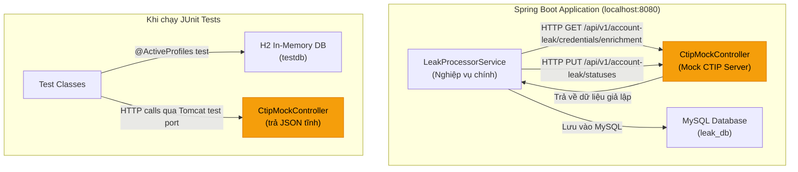
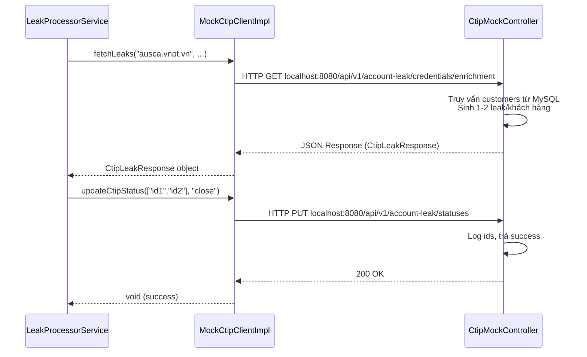
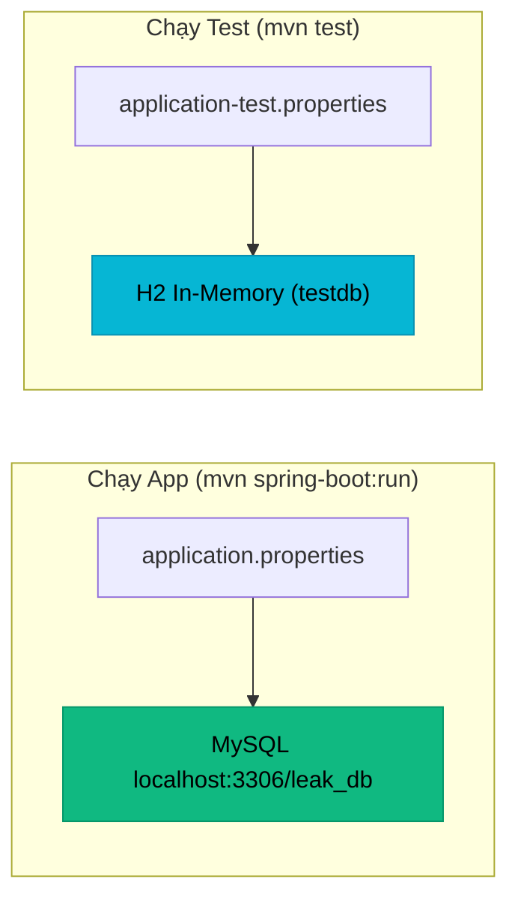

# Cơ chế Giả lập Dữ liệu & Mock API trong Dự án Leak Processor

## 1. Tổng quan Kiến trúc

Vì dự án chạy **nội bộ (localhost)** mà không kết nối tới máy chủ CTIP thật (`https://ctip.vnpt.vn`), toàn bộ luồng dữ liệu rò rỉ từ CTIP đều được **giả lập cục bộ** bằng một hệ thống Mock API tự phục vụ (Self-hosted Mock Server).



---

## 2. Các Thành phần Mock & Fake Data

### 2.1. Mock CTIP API Server — [CtipMockController.java](file:///c:/Users/Admin/Desktop/ThucTap/doc/leak-processor/src/main/java/com/vnpt/leakprocessor/controller/CtipMockController.java)

> [!IMPORTANT]
> Đây là thành phần cốt lõi nhất. Nó giả lập 2 API chính thức của hệ thống CTIP VNPT ngay bên trong ứng dụng Spring Boot.

#### API 1: Lấy danh sách tài khoản rò rỉ (GET)

| Thuộc tính | Giá trị |
|---|---|
| **URL** | `GET /api/v1/account-leak/credentials/enrichment` |
| **Mô tả** | Giả lập API quét tài khoản lộ lọt của CTIP |
| **Xác thực** | Header `x-key: a631d2e4-3b67-4694-96b2-df960826c3b2` |
| **Tham số** | `credential__search`, `created_at__gte`, `created_at__lte`, `page`, `size` |

**Logic sinh dữ liệu có 2 chế độ:**

**Chế độ 1 — Sinh ngẫu nhiên theo Khách hàng (Khi chạy App thật)**:
- Controller truy vấn bảng `customers` trong MySQL.
- Với **mỗi khách hàng**, sinh ngẫu nhiên **1-2 bản ghi rò rỉ** với:
  - `credential_id` và `status_id`: UUID ngẫu nhiên
  - `username`: Lấy từ `customer.username` (đây là trường mapping chính)
  - `password`: Sinh chuỗi ngẫu nhiên `Leak@xxxxxxxx`
  - `severity`: Ngẫu nhiên trong `["low", "medium", "high", "critical"]`
  - `url`: Ngẫu nhiên giữa `https://ausca.vnpt.vn/...` hoặc `https://smartca.vnpt.vn/...`
  - `status`: Luôn là `"open"` (chưa xử lý)
- Thêm 1 bản ghi **unmapped** (`unmapped_user_xxx`) để kiểm thử luồng `CUSTOMER_NOT_FOUND`.

**Chế độ 2 — Trả JSON tĩnh (Khi chạy JUnit Test hoặc DB rỗng)**:
- Phát hiện môi trường test bằng cách quét `Thread.getAllStackTraces()` tìm `org.junit.*`.
- Nếu là test hoặc bảng `customers` rỗng → đọc file [mock-ctip-response.json](file:///c:/Users/Admin/Desktop/ThucTap/doc/leak-processor/src/main/resources/mock-ctip-response.json).
- File JSON tĩnh chứa **~20 bản ghi** cố định với username, password, severity, URL đã định sẵn.

**Xử lý phân trang & lọc:**
- Lọc theo domain trong URL (tham số `credential__search`)
- Lọc theo khoảng ngày tạo (`created_at__gte`, `created_at__lte`)
- Tính toán phân trang thực tế (`page`, `size`, `pages`, `total`)

#### API 2: Đóng trạng thái sự cố trên CTIP (PUT)

| Thuộc tính | Giá trị |
|---|---|
| **URL** | `PUT /api/v1/account-leak/statuses` |
| **Mô tả** | Giả lập API cập nhật trạng thái `"close"` cho các sự cố đã xử lý |
| **Body** | `{ "ids": ["status_id_1", ...], "status": "close", "comment": "" }` |
| **Phản hồi** | Luôn trả `200 OK` + `{"status": "success", ...}` |

> API PUT Mock này không thực sự thay đổi dữ liệu gì. Nó chỉ ghi log và trả về thành công để ứng dụng tiếp tục cập nhật trạng thái `PROCESSED` trong MySQL.

---

### 2.2. CTIP HTTP Client — [MockCtipClientImpl.java](file:///c:/Users/Admin/Desktop/ThucTap/doc/leak-processor/src/main/java/com/vnpt/leakprocessor/client/impl/MockCtipClientImpl.java)

Đây là lớp **triển khai thực tế** của interface [CtipClient.java](file:///c:/Users/Admin/Desktop/ThucTap/doc/leak-processor/src/main/java/com/vnpt/leakprocessor/client/CtipClient.java). Mặc dù tên là "Mock", nó thực sự gửi **HTTP request thật** qua `RestTemplate`:

| Phương thức | Hành vi |
|---|---|
| `fetchLeaks(...)` | Gửi `HTTP GET` đến `{ctip.api.url}/api/v1/account-leak/credentials/enrichment` |
| `updateCtipStatus(...)` | Gửi `HTTP PUT` đến `{ctip.api.url}/api/v1/account-leak/statuses` |

**Điểm mấu chốt**: Trong [application.properties](file:///c:/Users/Admin/Desktop/ThucTap/doc/leak-processor/src/main/resources/application.properties), `ctip.api.url` được cấu hình là:
```properties
ctip.api.url=http://localhost:8080
```

→ Kết quả: Client gửi HTTP request **đến chính mình** (localhost:8080), nơi `CtipMockController` đang lắng nghe. Đây chính là cơ chế **Self-loop Mock**.



---

### 2.3. Dữ liệu JSON tĩnh — [mock-ctip-response.json](file:///c:/Users/Admin/Desktop/ThucTap/doc/leak-processor/src/main/resources/mock-ctip-response.json)

File JSON chứa **~20 bản ghi rò rỉ cố định** với cấu trúc:

```json
{
  "credential_id": "019adf91-e7e5-7061-bf20-3971f1a44ab7",
  "created_at": "2025-12-01T14:09:21.153+07:00",
  "first_compromise_time": "2025-11-03T00:00:00+07:00",
  "url": "https://ausca.vnpt.vn/account/login",
  "username": "066095002466",
  "password": "Tamtri@123",
  "severity": "medium",
  "status_id": "019adf91-e7e5-7061-bf20-3971f1a44ab7",
  "status": "open"
}
```

**Khi nào được sử dụng:**
- Khi bảng `customers` trong MySQL rỗng (chưa thêm khách hàng nào)
- Khi chạy bộ kiểm thử tự động JUnit (tự động phát hiện qua stack trace)

---

### 2.4. Khởi tạo Mẫu Email — [DataInitializer.java](file:///c:/Users/Admin/Desktop/ThucTap/doc/leak-processor/src/main/java/com/vnpt/leakprocessor/config/DataInitializer.java)

Khi ứng dụng khởi động lần đầu, `DataInitializer` (implements `CommandLineRunner`) sẽ:
1. Kiểm tra xem bảng `email_templates` đã có template `"smartca-warning"` chưa.
2. Nếu chưa có → Tự động chèn 1 bản ghi email HTML hoàn chỉnh (mẫu cảnh báo bảo mật VNPT SmartCA) vào CSDL.
3. Nếu đã tồn tại → Bỏ qua (không ghi đè).

---

### 2.5. API Test thủ công — [CtipTestController.java](file:///c:/Users/Admin/Desktop/ThucTap/doc/leak-processor/src/main/java/com/vnpt/leakprocessor/controller/CtipTestController.java)

Cung cấp các endpoint REST để **kích hoạt thủ công từng bước** riêng lẻ qua trình duyệt hoặc Postman:

| Endpoint | Phương thức | Mô tả |
|---|---|---|
| `/api/v1/test/ctip/scan` | `POST` | Kích hoạt quét tài khoản rò rỉ (Bước 1) |
| `/api/v1/test/ctip/send-emails` | `POST` | Kích hoạt gửi email cảnh báo (Bước 2) |
| `/api/v1/test/ctip/sync` | `POST` | Kích hoạt đồng bộ đóng CTIP (Bước 3) |
| `/api/v1/test/ctip/email/send?to=...` | `GET` | Gửi 1 email test đến địa chỉ cụ thể |

---

## 3. Cô lập CSDL khi chạy Test

### Vấn đề
Các bộ test JUnit có bước `deleteAll()` để dọn dẹp dữ liệu trước mỗi ca test. Nếu test kết nối vào MySQL thật → **xóa sạch dữ liệu khách hàng**.

### Giải pháp
Sử dụng **H2 In-Memory Database** riêng biệt cho môi trường test:

| Thành phần | File |
|---|---|
| **Cấu hình H2** | [application-test.properties](file:///c:/Users/Admin/Desktop/ThucTap/doc/leak-processor/src/test/resources/application-test.properties) |
| **Kích hoạt profile** | `@ActiveProfiles("test")` trên mỗi lớp test |
| **Thư viện** | `com.h2database:h2` với `<scope>test</scope>` trong [pom.xml](file:///c:/Users/Admin/Desktop/ThucTap/doc/leak-processor/pom.xml) |



---

## 4. Tổng kết: Bản đồ toàn bộ cơ chế Mock/Fake

| # | Thành phần | Loại | Chức năng | Khi nào hoạt động |
|---|---|---|---|---|
| 1 | `CtipMockController` | Mock API Server | Giả lập 2 API chính thức của CTIP (GET + PUT) | Luôn luôn (chạy cùng app) |
| 2 | `MockCtipClientImpl` | HTTP Client | Gửi HTTP request thực đến Mock Server cục bộ | Luôn luôn |
| 3 | `mock-ctip-response.json` | Fake Data (tĩnh) | Dữ liệu rò rỉ cố định dùng khi DB rỗng hoặc chạy test | Khi customers rỗng / JUnit |
| 4 | Dynamic Leak Generator | Fake Data (động) | Sinh ngẫu nhiên 1-2 leak/khách hàng từ DB thật | Khi customers có dữ liệu |
| 5 | `DataInitializer` | Seed Data | Tự chèn mẫu email HTML vào DB khi khởi động | Lần chạy đầu tiên |
| 6 | `CtipTestController` | Test Endpoints | API thủ công kích hoạt từng bước nghiệp vụ | Theo yêu cầu (Postman) |
| 7 | `application-test.properties` | Test Config | Cấu hình H2 database cho JUnit | Khi chạy `mvn test` |

> [!TIP]
> **Chuyển sang CTIP thật**: Chỉ cần đổi `ctip.api.url` trong `application.properties` từ `http://localhost:8080` sang `https://ctip.vnpt.vn` là toàn bộ hệ thống sẽ kết nối tới server CTIP thật mà không cần thay đổi bất kỳ dòng code nào.
