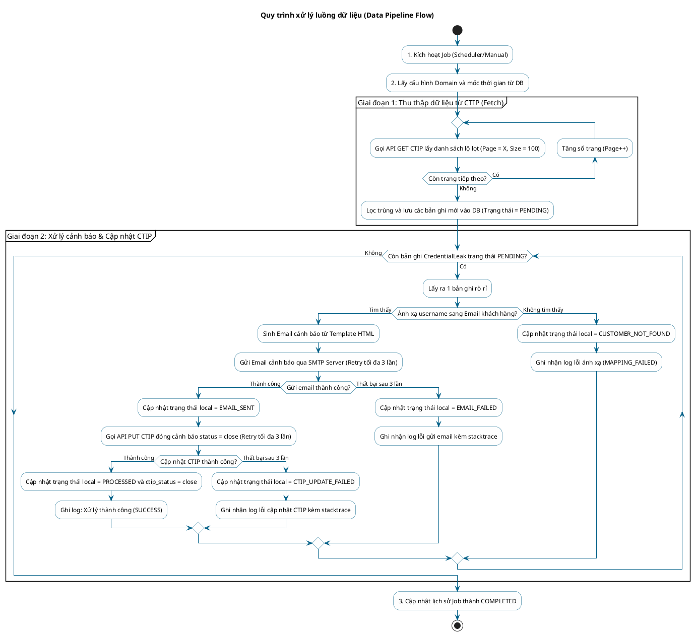

# TÀI LIỆU THIẾT KẾ KIẾN TRÚC HỆ THỐNG (SAD)
## Hệ thống Cảnh báo và Cập nhật Trạng thái Tài khoản Lộ lọt từ VNPT CTIP

---

## 1. Tổng quan Kiến trúc (Architectural Overview)

Hệ thống được thiết kế theo mô hình **Kiến trúc phân lớp (Layered Architecture)** tích hợp đầy đủ cả Backend Worker (dịch vụ chạy ngầm) và Frontend Portal (giao diện quản trị Admin) trong cùng một ứng dụng Spring Boot (Monolithic). 

### Sơ đồ Kiến trúc phân lớp nội bộ:
- **Presentation Layer (Tầng giao diện)**: Sử dụng **Spring MVC** kết hợp với **Thymeleaf Template Engine** để render giao diện HTML tĩnh động phía Server, định dạng bằng CSS/JS. Nhận tương tác trực tiếp từ Quản trị viên (Admin).
- **Client/Integration Layer (Tầng tích hợp ngoại vi)**: Giao tiếp với các dịch vụ bên ngoài gồm VNPT CTIP API (giao thức HTTP) và Mail Server (giao thức SMTP) qua REST Client (`RestTemplate`/`WebClient`) và `JavaMailSender`.
- **Business Logic Layer (Tầng nghiệp vụ)**: Chứa các Service chính điều phối luồng logic (Scheduler Service, Leak Processor Service, Customer Mapping Service, Mail Generation Service, Log Service).
- **Data Access Layer (Tầng truy cập dữ liệu)**: Sử dụng Spring Data JPA để tương tác với MySQL Database.
- **Data Layer (Tầng dữ liệu)**: Cơ sở dữ liệu quan hệ MySQL lưu trữ thông tin thực thể, dữ liệu lộ lọt thu thập và nhật ký thực thi.

---

## 2. Công nghệ Lựa chọn (Technology Stack)

| Thành phần | Công nghệ lựa chọn | Lý do lựa chọn |
| :--- | :--- | :--- |
| **Framework chính** | Java Spring Boot 3.x | Cung cấp sẵn hệ sinh thái vững chắc cho Scheduler, Web MVC, Email, tích hợp REST API và quản lý cấu hình. |
| **Giao diện (Frontend)**| Thymeleaf Template Engine | Tích hợp sâu vào Spring Boot, render trực tiếp HTML tĩnh phía Server, dễ viết mã Java logic trực tiếp trong thẻ HTML. |
| **Styling & UI** | Vanilla CSS & Bootstrap 5 | CSS thuần kết hợp Bootstrap giúp dựng giao diện quản trị Admin Responsive nhanh, chuyên nghiệp và có tính thẩm mỹ cao. |
| **Ngôn ngữ** | Java 17 hoặc cao hơn | Hỗ trợ lập trình hướng đối tượng mạnh mẽ, các tính năng hiện đại (Record, Pattern Matching, Stream API) giúp xử lý JSON tối ưu. |
| **Cơ sở dữ liệu** | MySQL 8.0 | Hệ quản trị cơ sở dữ liệu quan hệ ổn định, xử lý các quan hệ dữ liệu tốt, hiệu năng cao với chi phí vận hành thấp. |
| **Truy cập Dữ liệu** | Spring Data JPA (Hibernate) | Tự động hóa ánh xạ thực thể (ORM), rút ngắn thời gian phát triển và quản lý giao dịch (Transaction) an toàn. |
| **Tự động hóa tác vụ**| Spring Scheduler | Lập lịch Cron trực quan, gọn nhẹ, tích hợp sâu trong ứng dụng không cần cài thêm cron engine bên ngoài. |
| **Cơ chế chịu lỗi** | Spring Retry | Cung cấp declarative retry (sử dụng `@Retryable`) giúp tự động cấu hình cơ chế thử lại khi gọi API ngoài và SMTP lỗi kết nối mạng. |
| **Log định dạng** | Logback / SLF4J | Ghi log hệ thống ra file/console định dạng JSON để dễ tích hợp với các hệ thống Log Management như ELK/Splunk. |

---

## 3. Sơ đồ Thành phần Hệ thống (System Component Diagram)

Dưới đây là sơ đồ mô tả mối quan hệ giữa các component bên trong Spring Boot Application và các tài nguyên bên ngoài.

```mermaid
graph TD
    Admin[Quản trị viên - Admin] <-->|HTTPS / HTTP| WebUI[Thymeleaf Views <br/> HTML / CSS / JS]
    
    subgraph Spring Boot Application (Credential Leak Portal & Processor)
        direction TB
        WebUI <-->|Gửi Request / Nhận Model| WebController[Web Controllers <br/> Dashboard, Customers, Templates, Logs]
        Scheduler[Spring Scheduler <br/> LeakSchedulerJob] -->|Kích hoạt hàng ngày| Service[Leak Processor Service]
        WebController -->|Kích hoạt quét thủ công bất đồng bộ| Service
        WebController -->|CRUD Khách hàng & Template| CustService[Customer Service]
        WebController -->|Đọc Nhật ký log| LogService[Database Logger Service]
        
        Service -->|1. Quét thông tin rò rỉ| CTIPClient[VNPT CTIP Client <br/> RestTemplate/WebClient]
        Service -->|2. Ánh xạ thông tin khách hàng| CustService
        Service -->|3. Tạo & Gửi mail| MailService[Email Dispatcher <br/> JavaMailSender]
        Service -->|4. Cập nhật trạng thái xử lý| CTIPClient
        
        CustService -->|Truy vấn khách hàng| Repository[Spring Data JPA Repositories]
        Service -->|Ghi log hành trình| LogService
        LogService -->|Lưu nhật ký & Lịch sử| Repository
    end
    
    subgraph External Systems & Storage
        Repository -->|Đọc/Ghi dữ liệu| MySQL[(MySQL Database)]
        CTIPClient -->|HTTPS GET/PUT| CTIPAPI[VNPT CTIP API]
        MailService -->|SMTP/SSL| SMTPServer[VNPT Mail Server / SMTP Server]
    end

    SMTPServer -->|Gửi Email Cảnh báo| CustomerMail[Hòm thư Khách hàng]
```

### Giải thích các Thành phần và Mối liên kết trong Sơ đồ:

1. **Quản trị viên (Admin) & Giao diện (WebUI - Thymeleaf Views)**:
   - **Admin** tương tác trực tiếp với hệ thống thông qua trình duyệt Web gửi các yêu cầu HTTPS/HTTP đến **Thymeleaf Views**.
   - Giao diện được máy chủ xử lý động và trả về mã HTML/CSS/JS hiển thị các dữ liệu trực quan cho Admin.

2. **Tầng Điều phối Giao diện (Web Controllers)**:
   - **Web Controllers** tiếp nhận yêu cầu từ giao diện, đóng gói dữ liệu và chuyển tiếp xuống tầng nghiệp vụ.
   - Hỗ trợ các tác vụ: hiển thị số liệu Dashboard, thực hiện các truy vấn CRUD khách hàng/mẫu thư, hiển thị danh sách log, và tiếp nhận yêu cầu kích hoạt chạy quét thủ công.

3. **Bộ lập lịch chạy tự động (Spring Scheduler - LeakSchedulerJob)**:
   - Tự động kích hoạt hàng ngày theo thời gian định sẵn mà không cần sự can thiệp của Quản trị viên, trực tiếp gọi xuống **Leak Processor Service** để xử lý.

4. **Tầng Nghiệp vụ Logic (Business Logic Services)**:
   - **Leak Processor Service**: Trung tâm điều phối của toàn bộ tiến trình. Nó điều phối luồng dữ liệu bằng cách ra lệnh cho **CTIP Client** lấy thông tin rò rỉ, ra lệnh cho **Customer Service** ánh xạ email, gọi **Email Dispatcher** gửi cảnh báo, và cuối cùng yêu cầu **CTIP Client** đóng cảnh báo rò rỉ.
   - **Customer Service**: Thực hiện logic tìm kiếm và liên kết thông tin khách hàng dựa trên username rò rỉ. Đồng thời xử lý các yêu cầu CRUD từ giao diện quản trị Admin.
   - **Database Logger Service**: Ghi lại lịch sử chạy tổng quát (trong `job_history`) và ghi nhật ký chi tiết từng bước (trong `processing_logs`) để phục vụ kiểm tra lỗi.

5. **Tầng Tích hợp Ngoại vi (Client & Mail Integration)**:
   - **VNPT CTIP Client**: Thành phần chịu trách nhiệm đóng gói tham số, xử lý phân trang API GET và định dạng JSON API PUT để giao tiếp trực tiếp với **VNPT CTIP API** bên ngoài qua giao thức bảo mật HTTPS.
   - **Email Dispatcher**: Nhận thông tin mẫu thư đã được sinh ra, thiết lập kết nối mã hóa đến **SMTP Server** bên ngoài để gửi email cảnh báo tới hòm thư của khách hàng.

6. **Tầng Truy cập và Cơ sở Dữ liệu (Repository & MySQL)**:
   - **Spring Data JPA Repositories** đóng vai trò là cầu nối truy vấn dữ liệu từ **MySQL Database**. Toàn bộ dữ liệu cấu hình mẫu thư, lịch sử tiến trình chạy, thông tin rò rỉ, thông tin khách hàng đều được lưu trữ tập trung tại MySQL Database.

---

## 4. Thiết kế Luồng Dữ liệu (Data Flow / Pipeline Design)

Quy trình xử lý một chu kỳ quét (Pipeline) diễn ra theo các bước tuần tự nghiêm ngặt để đảm bảo tính nhất quán dữ liệu và tối ưu hóa tài nguyên mạng:



### Giải thích Luồng Dữ liệu Chi tiết (Detailed Pipeline Explanation):

Quy trình xử lý luồng dữ liệu (Data Pipeline) của hệ thống được chia làm **hai giai đoạn lớn độc lập** để đảm bảo tính tuần tự, dễ kiểm soát và không bị mất mát dữ liệu:

#### 1. Giai đoạn 1: Thu thập dữ liệu từ CTIP (Data Fetching Stage)
- **Bước 1.1**: Hệ thống kích hoạt Job tự động theo lịch đặt sẵn (Scheduler) hoặc Quản trị viên kích hoạt trực tiếp từ giao diện Admin.
- **Bước 1.2**: Ứng dụng đọc cấu hình các tên miền (Domain) cần quét từ bảng cấu hình hệ thống và tự động xác định thời gian quét gần nhất (`created_at__gte` và `created_at__lte`) để bảo đảm không bị sót dữ liệu.
- **Bước 1.3 - Gọi lặp phân trang (Pagination)**:
  - Do API CTIP giới hạn số lượng trả về tối đa 100 bản ghi/trang (`size=100`), hệ thống thực hiện vòng lặp gọi API bắt đầu từ `page=1`.
  - Sau mỗi phản hồi của CTIP, hệ thống đọc thuộc tính `pages` (tổng số trang) và tăng biến đếm trang lên 1 đơn vị để gọi trang tiếp theo. Vòng lặp chỉ kết thúc khi hệ thống đã gọi hết tất cả các trang.
  - **Cơ chế chịu lỗi**: Trong quá trình gọi API GET, nếu gặp lỗi mạng tạm thời, Spring Retry sẽ thử lại 3 lần. Nếu thất bại hoàn toàn, tiến trình quét dừng lại và Job được ghi nhận trạng thái `FAILED`.
- **Bước 1.4 - Lọc trùng và Lưu trữ**:
  - Dữ liệu thô lấy về từ CTIP sẽ được đối chiếu với cơ sở dữ liệu nội bộ qua trường `credential_id` (được thiết lập chỉ mục duy nhất `UNIQUE`).
  - Hệ thống chỉ lưu mới các bản ghi chưa từng tồn tại trước đây với trạng thái xử lý cục bộ là `PENDING` (chờ xử lý). Mật khẩu của tài khoản bị lộ lọt được mã hóa AES-256 ngay lập tức trước khi lưu xuống đĩa.

#### 2. Giai đoạn 2: Xử lý Cảnh báo & Đồng bộ CTIP (Processing & Synchronization Stage)
- **Bước 2.1 - Đọc dữ liệu chờ xử lý**: Hệ thống truy vấn toàn bộ các bản ghi rò rỉ đang có trạng thái `PENDING` trong bảng `credential_leaks` và lặp qua từng bản ghi.
- **Bước 2.2 - Ánh xạ thông tin Khách hàng (Customer Mapping)**:
  - Từ `username` lấy được của CTIP, hệ thống tìm kiếm trong bảng `customers` để lấy địa chỉ `email` liên hệ chính xác.
  - Nếu không tìm thấy khách hàng tương ứng (ví dụ: tài khoản rò rỉ không thuộc tệp quản lý), hệ thống ghi nhận trạng thái là `CUSTOMER_NOT_FOUND`, lưu một log báo lỗi vào bảng `processing_logs` và chuyển ngay sang xử lý dòng tiếp theo.
- **Bước 2.3 - Sinh và Gửi thư cảnh báo (Email Generation & Dispatch)**:
  - Nếu tìm thấy email khách hàng, hệ thống lấy mẫu thư HTML từ bảng `email_templates`, thực hiện thay thế các biến động (`${username}`, `${password_masked}`, v.v.) thành thông tin thật.
  - Thực hiện gửi email thông qua cổng SMTP Server. Giai đoạn này áp dụng cơ chế tự động thử lại (Retry) của Spring Retry lên đến 3 lần kèm theo chính sách giãn cách thời gian để vượt qua lỗi nghẽn máy chủ SMTP.
  - Nếu gửi email thành công, trạng thái cục bộ của bản ghi chuyển thành `EMAIL_SENT`. Nếu lỗi kéo dài sau 3 lần thử lại, trạng thái chuyển thành `EMAIL_FAILED` và lưu chi tiết stacktrace ngoại lệ để kỹ thuật viên kiểm tra.
- **Bước 2.4 - Đồng bộ đóng trạng thái CTIP (CTIP Synchronization)**:
  - Chỉ khi email được gửi thành công đến người dùng (trạng thái `EMAIL_SENT`), hệ thống mới gọi API PUT của VNPT CTIP để thay đổi trạng thái của `status_id` tương ứng thành `close`.
  - Tiếp tục sử dụng Spring Retry 3 lần cho thao tác API PUT này. Nếu thành công, cập nhật trạng thái cục bộ của bản ghi thành `PROCESSED` và `ctip_status = close`. Nếu lỗi, chuyển trạng thái thành `CTIP_UPDATE_FAILED` và ghi nhận log tương ứng.

#### 3. Bước 3: Tổng kết Job (Job Finalization)
- Sau khi xử lý xong toàn bộ danh sách bản ghi lộ lọt, hệ thống cập nhật kết quả thống kê (tổng quét, gửi mail thành công, lỗi) và ghi nhận thời điểm kết thúc (`end_time`), đổi trạng thái chạy của Job trong bảng `job_history` thành `SUCCESS` hoặc `FAILED`.
- Giao diện Admin nhận được cập nhật thông tin qua cơ chế làm mới AJAX.

---

## 5. Thiết kế An toàn Thông tin & Bảo mật (Security Design)

1. **Bảo mật kênh truyền dữ liệu**:
   - Mọi kết nối gọi đến VNPT CTIP API đều phải đi qua giao thức **HTTPS (TLS 1.2 hoặc TLS 1.3)** để chống nghe lén dữ liệu rò rỉ nhạy cảm.
   - Kết nối đến SMTP Server bắt buộc sử dụng **SSL/TLS** hoặc mã hóa cổng **STARTTLS** (Port 465 hoặc 587).

2. **Bảo vệ Secrets & API Keys**:
   - `x-key` định danh kết nối CTIP không được lưu rõ trong code. Cấu hình sử dụng biến môi trường hệ thống:
     ```properties
     ctip.api.key=${CTIP_API_KEY}
     spring.mail.password=${SMTP_PASSWORD}
     ```
   - Hỗ trợ giải pháp mã hóa file cấu hình `application.properties` sử dụng thư viện **Jasypt** trong Spring Boot.

3. **Bảo mật dữ liệu mật khẩu lộ lọt trong Database (MySQL)**:
   - Các mật khẩu thô lấy về từ CTIP (`Tamtri@123`) khi lưu trữ vào bảng `credential_leaks` phải được **mã hóa đối xứng (AES-256)** bằng một khóa Secret Key của ứng dụng (Application Key). Tuyệt đối không lưu mật khẩu thô ở dạng rõ (Plaintext) để đề phòng trường hợp database MySQL bị tấn công.
   - Mật khẩu khi hiển thị ra bên ngoài (hoặc hiển thị trong email gửi đi) phải được che giấu một phần (ví dụ: `Tam***123`).

---

## 6. Thiết kế Chịu lỗi & Xử lý Ngoại lệ (Resilience & Exception Design)

Hệ thống áp dụng cơ chế tự phục hồi lỗi tạm thời nhờ cấu hình **Spring Retry**:

1. **Đối với lỗi gọi API CTIP**:
   - Các mã lỗi HTTP `5xx` (Server Error), `429` (Too Many Requests), hoặc lỗi Timeout kết nối mạng sẽ được tự động kích hoạt thử lại tối đa 3 lần. Khoảng cách thử lại mặc định là 5 giây.
   - Lỗi HTTP `401` (Unauthorized) hoặc `403` (Forbidden) sẽ **không thử lại** và dừng tác vụ ngay lập tức, vì đây là lỗi cấu hình API Key sai cần Admin xử lý thủ công.

2. **Đối với lỗi gửi mail SMTP**:
   - Lỗi kết nối SMTP server (Timeout) sẽ thử lại tối đa 3 lần với chính sách **Exponential Backoff** (Lần 1 cách 5s, Lần 2 cách 10s, Lần 3 cách 20s).
   - Lỗi sai địa chỉ email nhận (RFC 822 format check) hoặc bị Reject từ server nhận dạng cứng (Permanent Failure) sẽ **không thử lại**, hệ thống lập tức đánh dấu lỗi và chuyển qua bản ghi tiếp theo.
