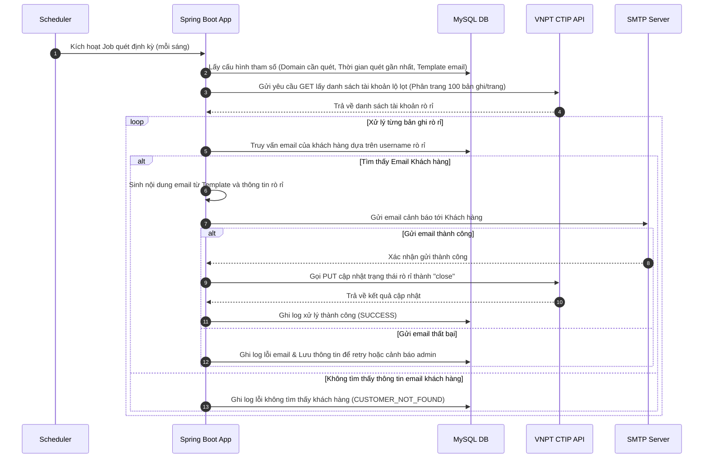

# TÀI LIỆU TẢ YÊU CẦU PHẦN MỀM (SRS)
## Hệ thống Cảnh báo và Cập nhật Trạng thái Tài khoản Lộ lọt từ VNPT CTIP

---

## 1. Giới thiệu (Introduction)

### 1.1. Mục đích (Purpose)
Tài liệu này mô tả các yêu cầu nghiệp vụ, yêu cầu chức năng và phi chức năng cho hệ thống tự động quét, cảnh báo và xử lý tài khoản bị lộ lọt thông tin đăng nhập (Credential Leak). Hệ thống tích hợp với nền tảng VNPT CTIP (Cyber Threat Intelligence Platform) để lấy dữ liệu lộ lọt, thực hiện gửi email cảnh báo tới người dùng cuối, và cập nhật trạng thái xử lý trở lại CTIP.

### 1.2. Phạm vi hệ thống (Scope)
Hệ thống là một dịch vụ chạy ngầm (Background Service/Scheduler) phát triển trên nền tảng Java Spring Boot, kết nối cơ sở dữ liệu MySQL, tích hợp API của VNPT CTIP và dịch vụ gửi mail SMTP.
Hệ thống giải quyết các vấn đề chính:
- Tự động hóa việc quét thông tin tài khoản bị lộ lọt định kỳ.
- Ánh xạ định danh người dùng (username/số điện thoại) sang email khách hàng để cảnh báo.
- Gửi thông tin cảnh báo tự động qua email.
- Phản hồi trạng thái xử lý lên nền tảng giám sát tập trung CTIP.
- Ghi nhật ký (log) chi tiết hành trình xử lý và cơ chế xử lý lỗi/thử lại (retry).

### 1.3. Thuật ngữ & Từ viết tắt (Definitions & Acronyms)
- **CTIP**: Cyber Threat Intelligence Platform (Nền tảng tri thức mối đe dọa an ninh mạng của VNPT).
- **Credential Leak**: Thông tin đăng nhập bị lộ lọt (thường gồm username, password, URL rò rỉ, thời gian rò rỉ).
- **SMTP**: Simple Mail Transfer Protocol (Giao thức truyền tải thư điện tử đơn giản).
- **Scheduler**: Bộ lập lịch công việc tự động chạy theo chu kỳ thời gian (Cron Job).
- **API Key**: Khóa định danh bảo mật dùng để xác thực quyền gọi API của CTIP (`x-key`).
- **Status ID**: Mã định danh trạng thái rò rỉ trên CTIP cần cập nhật.

---

## 2. Mô tả Tổng quan (Overall Description)

### 2.1. Bối cảnh Hệ thống (System Perspective)
Hệ thống hoạt động độc lập như một ứng dụng nghiệp vụ tự động hóa (Worker). Sơ đồ khối tương tác bên ngoài bao gồm:
1. **VNPT CTIP API**: Cung cấp danh sách tài khoản lộ lọt và tiếp nhận cập nhật trạng thái xử lý.
2. **Database (MySQL)**: Lưu trữ cấu hình hệ thống, thông tin khách hàng, danh sách rò rỉ đã quét và lịch sử xử lý (Logs).
3. **Mail Server (SMTP)**: Gửi thư cảnh báo tới hòm thư của khách hàng bị ảnh hưởng.

### 2.2. Tác nhân Hệ thống (System Actors)
- **System Scheduler**: Tác nhân kích hoạt tiến trình xử lý tự động theo chu kỳ cấu hình (ví dụ: mỗi sáng lúc 07:00).
- **Administrator (Quản trị viên)**: Xem nhật ký hệ thống, cấu hình tham số hệ thống (SMTP, API URL, Cron expression, Email Template) trực tiếp qua database hoặc file cấu hình.
- **Customer (Khách hàng)**: Người nhận email cảnh báo về việc tài khoản của mình bị rò rỉ thông tin mật khẩu.

### 2.3. Quy trình Nghiệp vụ Tổng quát


---

## 3. Yêu cầu Chức năng (Functional Requirements)

### 3.1. Thiết lập chu kỳ lập lịch (Cron Job Scheduler)
- **Mô tả**: Cho phép cấu hình thời gian chạy tự động tiến trình lấy dữ liệu và gửi mail hàng ngày/hàng tuần.
- **Yêu cầu chi tiết**:
  - Hỗ trợ định dạng cấu hình Cron Expression chuẩn của Spring.
  - Mặc định khởi chạy vào lúc **07:00:00 hàng ngày**.
  - Đảm bảo cơ chế Thread Pool phù hợp để không bị nghẽn và không chạy đè chéo (sử dụng `@Scheduled` kết hợp khóa đồng bộ hoặc kiểm soát trạng thái chạy).

### 3.2. Lấy Danh sách Tài khoản Lộ lọt từ CTIP (Fetch Leak Credentials)
- **Mô tả**: Gọi API CTIP để lấy danh sách tài khoản rò rỉ thuộc các tên miền (domain) quản lý trong khoảng thời gian xác định.
- **Yêu cầu chi tiết**:
  - **Tham số đầu vào động**:
    - `credential__search`: Lọc theo các domain cần quét (ví dụ: `ausca.vnpt.vn`, `smartca.vnpt.vn`, `casign.vnpt.vn`). Danh sách domain này được cấu hình trong MySQL.
    - Khoảng thời gian: `created_at__gte` và `created_at__lte`. Tính toán tự động dựa trên chu kỳ chạy (ví dụ quét mỗi ngày thì lấy mốc từ `00:00:00` ngày hôm trước đến `23:59:59` ngày hôm trước).
    - `order_by`: Mặc định sắp xếp `-created_at` (mới nhất trước).
  - **Xử lý phân trang (Pagination)**:
    - API trả về tối đa 100 bản ghi trên mỗi trang (`size=100`).
    - Hệ thống bắt buộc phải kiểm tra thuộc tính `pages` hoặc `total` từ phản hồi để tự động gọi lặp (loop) qua các trang kế tiếp (`page=1`, `page=2`,...) cho đến khi thu thập đủ toàn bộ danh sách bản ghi lộ lọt trong chu kỳ.
  - **Lưu trữ tạm**: Danh sách lấy về được lưu hoặc cập nhật vào bảng dữ liệu rò rỉ (`credential_leaks`) trong database để phục vụ đối soát, gửi mail và cập nhật trạng thái.

### 3.3. Ánh xạ Tài khoản và Sinh Email Cảnh báo (Email Generation & Mapping)
- **Mô tả**: Xác định thông tin email nhận cảnh báo dựa trên username bị lộ và sinh nội dung thư từ mẫu chuẩn.
- **Yêu cầu chi tiết**:
  - **Ánh xạ khách hàng**: Do username lộ lọt có thể là Số điện thoại, Email hoặc Mã số thuế, hệ thống phải thực hiện câu truy vấn vào bảng `customers` để lấy thông tin Email chính thức của tài khoản đó.
  - **Quản lý Template**: Nội dung email cảnh báo được quản lý dạng Template lưu trong DB, hỗ trợ các biến thay thế động:
    - `${customer_name}`: Tên khách hàng.
    - `${username}`: Tài khoản bị lộ.
    - `${password_masked}`: Mật khẩu bị lộ (cần che bớt ký tự để bảo mật, ví dụ: `Tamtri@123` -> `Tam***123`).
    - `${leak_source}`: URL nguồn bị lộ.
    - `${leak_time}`: Thời gian phát hiện lộ lọt.
    - `${severity}`: Mức độ nghiêm trọng (`low`, `medium`, `high`, `critical`).

### 3.4. Gửi Email Cảnh báo (Email Dispatch)
- **Mô tả**: Thực hiện gửi email cảnh báo thông qua SMTP.
- **Yêu cầu chi tiết**:
  - Sử dụng thư viện JavaMailSender của Spring Boot.
  - Hỗ trợ gửi email dạng HTML để định dạng văn bản trực quan, chuyên nghiệp.
  - Trường hợp gửi mail thành công, cập nhật trạng thái bản ghi trong DB thành `EMAIL_SENT`.
  - Trường hợp gửi thất bại, ném ngoại lệ để kích hoạt cơ chế Retry.

### 3.5. Cập nhật Trạng thái Xử lý lên CTIP (Update CTIP Status)
- **Mô tả**: Sau khi gửi mail cảnh báo thành công cho khách hàng, hệ thống gọi API PUT của CTIP để đóng cảnh báo.
- **Yêu cầu chi tiết**:
  - Endpoint: `PUT https://ctip.vnpt.vn/api/v1/account-leak/statuses`
  - Body dữ liệu gửi đi:
    ```json
    {
        "ids": ["<status_id_nhan_duoc_tu_api_get>"],
        "status": "close",
        "comment": "Đã gửi email cảnh báo tự động yêu cầu khách hàng thay đổi mật khẩu."
    }
    ```
  - Cập nhật trạng thái bản ghi trong DB thành `PROCESSED` (hoặc `CLOSED_ON_CTIP`).

### 3.6. Ghi nhật ký Xử lý (Database Logging)
- **Mô tả**: Lưu lại lịch sử từng bước thực thi để phục vụ giám sát và tra cứu lỗi.
- **Yêu cầu chi tiết**:
  - Mỗi chu kỳ chạy (Job Run) sinh ra 1 bản ghi lịch sử chạy (`job_history`) gồm: ID, thời gian bắt đầu, kết thúc, số bản ghi quét được, số mail gửi thành công, số mail thất bại, trạng thái Job.
  - Mỗi bản ghi lộ lọt xử lý sinh ra log chi tiết trong bảng `processing_logs` gồm: trạng thái các bước (Fetch -> Map Customer -> Send Mail -> Update CTIP Status), thông tin chi tiết lỗi nếu có (Exception message, stacktrace).

### 3.7. Xử lý Ngoại lệ và Thử lại (Exception Handling & Retry Policy)
- **Mô tả**: Đảm bảo hệ thống hoạt động ổn định khi gặp sự cố gián đoạn mạng, máy chủ mail lỗi hoặc CTIP quá tải.
- **Yêu cầu chi tiết**:
  - Áp dụng thư viện **Spring Retry** cho hai hành động nhạy cảm lỗi mạng:
    1. **Gọi API CTIP (GET/PUT)**: Nếu lỗi kết nối HTTP (5xx, Timeout), tự động thử lại tối đa **3 lần**, khoảng cách giữa các lần thử lại là **5 giây** (Backoff policy).
    2. **Gửi Email**: Nếu máy chủ SMTP từ chối hoặc lỗi mạng tạm thời, tự động thử lại tối đa **3 lần** với thời gian giãn cách tăng dần (exponential backoff).
  - Nếu sau 3 lần thử lại vẫn thất bại:
    - Ghi nhận lỗi chi tiết vào bảng `processing_logs`.
    - Đánh dấu bản ghi trạng thái tương ứng: `EMAIL_FAILED` hoặc `CTIP_UPDATE_FAILED`.
    - Sinh cảnh báo nội bộ (Log error mức SEVERE hoặc gửi mail báo cáo sự cố cho Quản trị viên hệ thống).

### 3.8. Giao diện Quản trị Hệ thống (Admin Web Dashboard)
- **Mô tả**: Cung cấp giao diện web tích hợp (Thymeleaf) để Quản trị viên (Admin) giám sát tiến trình và quản lý cấu hình.
- **Yêu cầu chi tiết**:
  - **Trang chủ Dashboard (Tổng quan)**:
    - Hiển thị các biểu đồ/chỉ số thống kê: Tổng số tài khoản lộ lọt thu thập, số lượng email gửi thành công, số lượng email thất bại, số lượng trạng thái đã đóng trên CTIP.
    - Hiển thị danh sách 10 lượt chạy Scheduler Job gần nhất (`job_history`) và trạng thái tương ứng (`RUNNING`, `SUCCESS`, `FAILED`).
  - **Kích hoạt quét thủ công (Manual Job Trigger)**:
    - Cung cấp nút bấm "Kích hoạt quét ngay" để Admin chạy job thủ công bất cứ lúc nào thay vì chờ thời gian Scheduler.
    - Khi bấm, Backend sẽ thực hiện chạy Job bất đồng bộ (Asynchronous) và trả về thông báo đã kích hoạt thành công trên UI. Giao diện sẽ tự động cập nhật trạng thái qua cơ chế Auto-refresh hoặc AJAX polling.
  - **Quản lý Ánh xạ Khách hàng (`customers`)**:
    - Hiển thị danh sách khách hàng gồm: Tên, Username (SĐT/Email), Email nhận thông báo.
    - Cung cấp biểu mẫu Thêm mới, Chỉnh sửa, Xóa thông tin khách hàng trực tiếp trên UI để cập nhật bảng ánh xạ.
  - **Quản lý Mẫu Email Cảnh báo (`email_templates`)**:
    - Danh sách các mẫu email hiện có.
    - Trình soạn thảo văn bản đơn giản cho phép Admin sửa nội dung tiêu đề (`subject`) và nội dung HTML (`body_html`) chứa các biến động `${username}`, `${password_masked}`, v.v.
  - **Tra cứu Nhật ký xử lý (`processing_logs`)**:
    - Bộ lọc tìm kiếm lịch sử xử lý theo `username`, `status_id` hoặc trạng thái (`SUCCESS`, `FAILED`).
    - Xem chi tiết thông tin lỗi và Stacktrace của các bước xử lý thất bại để nhanh chóng khắc phục sự cố.

---

## 4. Yêu cầu Giao diện & Kết nối Ngoại vi (External Interface Requirements)

### 4.1. Kết nối API VNPT CTIP

#### 4.1.1. API Lấy danh sách tài khoản lộ lọt
- **Giao thức**: HTTP/HTTPS
- **Phương thức**: GET
- **Đường dẫn**: `https://ctip.vnpt.vn/api/v1/account-leak/credentials/enrichment`
- **Headers**:
  - `accept`: `application/json`
  - `x-key`: `<API_KEY_SECRET>`
- **Query Parameters**:
  - `order_by`: Tiêu chí sắp xếp (ví dụ: `-created_at`).
  - `created_at__gte`: Thời gian bắt đầu lọc định dạng ISO 8601 (`YYYY-MM-DD` hoặc `YYYY-MM-DDTHH:mm:ss+07:00`).
  - `created_at__lte`: Thời gian kết thúc lọc.
  - `credential__search`: Domain mục tiêu (ví dụ: `ausca.vnpt.vn`).
  - `page`: Trang hiện tại (bắt đầu từ 1).
  - `size`: Số lượng bản ghi/trang (Tối đa 100).
- **Dữ liệu trả về (Response JSON)**:
  ```json
  {
    "total": 22,
    "page": 1,
    "size": 100,
    "pages": 1,
    "results": [
      {
        "credential_id": "08b2abaa-8c39-4659-98d0-e55bdca0ff8b",
        "created_at": "2025-12-01T14:09:21.153195+07:00",
        "group_id": "d5017bcf-18ed-4e70-9b90-124c6ecbde68",
        "group_name": null,
        "first_compromise_time": "2025-11-01T00:00:00+07:00",
        "url": "https://ausca.vnpt.vn/account/login",
        "username": "034081008727",
        "password": "t13g20p02h13",
        "severity": "medium",
        "status_id": "019ad8be-9981-7982-9a1c-9010dd8895f5",
        "status": "open"
      }
    ]
  }
  ```

#### 4.1.2. API Cập nhật trạng thái lộ lọt trên CTIP
- **Giao thức**: HTTP/HTTPS
- **Phương thức**: PUT
- **Đường dẫn**: `https://ctip.vnpt.vn/api/v1/account-leak/statuses`
- **Headers**:
  - `accept`: `application/json`
  - `x-key`: `<API_KEY_SECRET>`
  - `Content-Type`: `application/json`
- **Dữ liệu gửi lên (Request Body)**:
  ```json
  {
      "ids": [
          "019ad8be-9981-7982-9a1c-9010dd8895f5"
      ],
      "status": "close",
      "comment": "Đã gửi mail cảnh báo tới khách hàng."
  }
  ```
- **Dữ liệu trả về (Response JSON)**:
  ```json
  {
    "status": "success",
    "updated_count": 1
  }
  ```

### 4.2. Kết nối Mail Server (SMTP)
- **Giao thức**: SMTP/SMTPS
- **Cấu hình yêu cầu**:
  - Hostname (ví dụ: `smtp.vnpt.vn` hoặc `smtp.gmail.com`).
  - Port (ví dụ: 465 cho SSL, 587 cho TLS).
  - Username & Password tài khoản gửi thư hệ thống.
  - Giao thức bảo mật mã hóa kết nối bắt buộc: TLS/SSL.

---

## 5. Yêu cầu Phi chức năng (Non-Functional Requirements)

### 5.1. An toàn thông tin & Bảo mật (Security)
- **Mật khẩu lộ lọt trong DB**: Mật khẩu lấy về từ CTIP phải được che giấu (masking) khi hiển thị hoặc lưu log. Trường hợp lưu trữ trong database để phân tích, phải có cơ chế mã hóa dữ liệu tại tầng DB (Database Encryption) hoặc mã hóa bất đối xứng để tránh rò rỉ lần hai từ chính hệ thống.
- **Quản lý Secrets**: Các thông tin bảo mật nhạy cảm như `x-key` (CTIP API Key) và Mật khẩu SMTP phải được lưu cấu hình an toàn (sử dụng biến môi trường, Spring Cloud Config Encrypted, Vault hoặc các trường mã hóa trong DB). Không được lưu cứng (hard-code) dưới dạng text rõ trong mã nguồn.

### 5.2. Hiệu năng & Khả năng chịu tải (Performance)
- **Xử lý bất đồng bộ (Asynchronous)**: Gửi email là tiến trình tốn thời gian. Cần thiết kế sử dụng Thread Pool riêng cho việc gửi mail (ví dụ sử dụng `@Async` trong Spring Boot hoặc triển khai Queue nội bộ) để không làm nghẽn tiến trình Scheduler chính.
- **Tối ưu truy vấn DB**: Các bảng lưu dữ liệu lộ lọt và log cần được tạo Index hợp lý trên các trường tìm kiếm thường xuyên như `username`, `status_id`, `created_at`, và `status` để đảm bảo hiệu năng khi dữ liệu tăng lớn theo thời gian.

### 5.3. Tính sẵn sàng & Tin cậy (Reliability & Recoverability)
- **Tránh trùng lặp cảnh báo**: Hệ thống phải kiểm tra xem `status_id` từ CTIP đã được xử lý thành công trong hệ thống nội bộ chưa (thông qua bảng `credential_leaks`). Tránh việc gửi email cảnh báo lặp đi lặp lại nhiều lần cho cùng một sự kiện rò rỉ thông tin trong trường hợp quét trùng chu kỳ thời gian.
- **Khôi phục lỗi**: Khi tiến trình bị ngắt đột ngột (mất điện, sập app), khi khởi động lại hệ thống phải có khả năng quét lại các bản ghi đang ở trạng thái dở dang (ví dụ `EMAIL_FAILED` hoặc `PENDING`) để hoàn thành chu trình xử lý.
